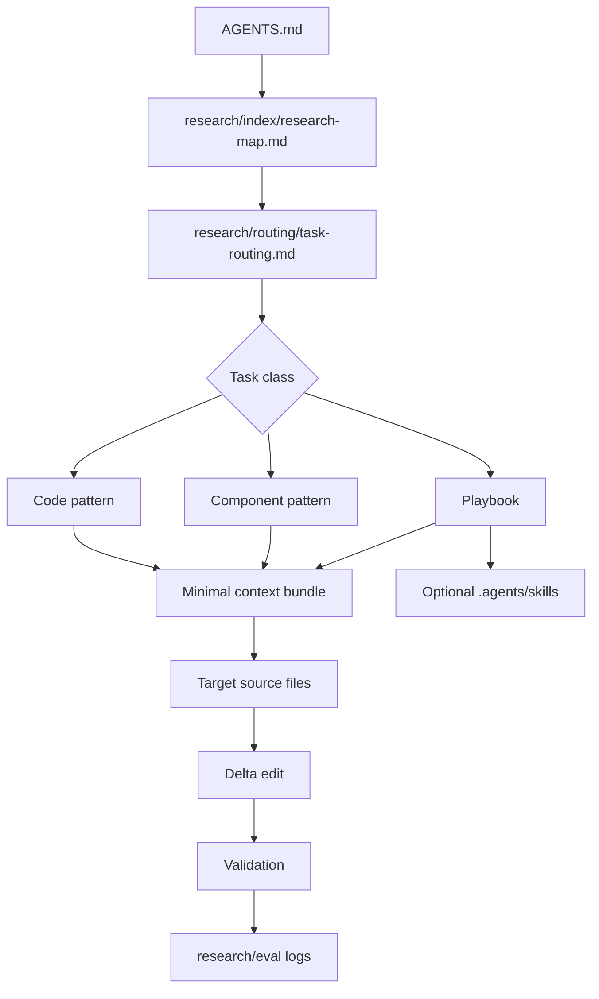

# agentic-workspace-research

## Executive summary

The decisive shift for an agentic coding workspace is to stop treating the model as the long-term holder of project knowledge and instead treat it as a short-lived executor that retrieves the smallest correct context bundle for each task. Official guidance from entity["company","OpenAI","ai company"], entity["company","Anthropic","ai company"], entity["company","GitHub","software platform"], entity["company","Google","search company"], and entity["company","Vercel","cloud platform"] converges on the same pattern: keep durable project rules concise, keep root-level instructions non-task-specific, scope detailed guidance closer to the code or content it governs, and prefer modular files over one large handbook loaded into every run. citeturn15view0turn15view2turn6view4turn17view1

On the retrieval side, the best practical design is hybrid and layered. Managed retrieval guidance already combines query rewriting, keyword plus semantic search, and reranking; retrieval research from a primary-source engineering writeup shows materially better results when contextual chunking, BM25, and reranking are combined; and chunking guidance from a major search platform recommends starting with mid-sized chunks, modest overlap, and heading-aware or semantic chunking where possible. That combination strongly favors a retrieval-first workspace built from split indexes, chunk-level metadata, reranked top-K results, and minimal prompt assembly rather than broad context stuffing. citeturn13view4turn11view1turn11view2turn3view5

For websites and SEO, the reusable knowledge that matters most is not generic “write good SEO” advice. It is operational knowledge: crawlable internal links, link architecture, canonical and alternate metadata, robots directives, sitemaps, JSON-LD that matches visible page content, and repeatable page patterns for routes such as service pages, blog posts, collections, location pages, and hub pages. Search documentation says crawlability depends on real anchor links with `href`, link architecture matters to discovery and navigation, and structured data should describe the visible page it appears on. Framework documentation exposes first-class APIs for metadata, canonical/alternate URLs, robots rules, sitemaps, and JSON-LD rendering. citeturn8view2turn8view3turn8view1turn9view0turn9view2turn7view1turn9view4

The recommended operating model is therefore simple: a short root `AGENTS.md`; a `research/` tree with a map, routing rules, schemas, primitives, playbooks, and patterns; split retrieval indexes; node-level delta editing instead of full rewrites; and a benchmark loop that tracks retrieved tokens, cached tokens, edit scope, and downstream SEO outcomes. Repeated workflows should graduate into playbooks and then, if the tool supports it, into reusable skills. citeturn4view5turn4view4turn14view0

## Design principles from primary sources

The strongest cross-vendor lesson is that instruction systems are not miniature wikis. They are startup context, and startup context is scarce. One platform merges root-to-current `AGENTS.md` files and caps combined project instructions at 32 KiB by default; another says startup memory files consume context every session, targets under 200 lines, and recommends path-scoped rules when instructions grow; a third explicitly advises repository instructions to stay high-level, under two pages, and non-task-specific. That means the root file in this workspace should be a router and contract, not a knowledge dump. citeturn15view0turn17view1turn15view1

| Surface | What the official docs imply | House rule for this workspace |
|---|---|---|
| Root agent file | Loaded every run or session, so length and clarity directly affect adherence and cost | Keep it short, durable, and non-task-specific |
| Path-scoped instructions | Closer files or matching rules narrow scope and reduce noise | Put framework-, route-, and directory-specific rules near the owned subtree |
| Multi-step procedures | Repeated workflows should move out of root memory and into skills or separate procedure files | Store them as playbooks, then compile into skills if useful |
| Repo-wide onboarding | Best use is build, test, layout, conventions, and validation, not one-off tasks | Put commands, repo map, and default validation here |
| Imports and large startup context | Imported or nested startup files can still consume launch context | Avoid import-heavy roots; prefer explicit retrieval of leaf docs |

The table above is a design synthesis of the cited discovery, precedence, and memory guidance. The common denominator is scope control: root files carry only rules that should apply almost every run, while detailed procedures belong in retrievable playbooks and local files. citeturn15view0turn6view0turn17view1turn6view4

A second important nuance is that precedence differs by tool. One system concatenates root-to-leaf instructions and later files effectively override earlier guidance because they appear later; another concatenates parent memory files and loads path-scoped rules on demand; a third combines repository-wide and path-specific instructions, while also honoring the nearest `AGENTS.md` in the tree. Because the semantics are similar but not identical, the safest cross-tool design is not clever inheritance. It is a canonical root `AGENTS.md`, thin compatibility shims for other tools, and small local leaf files that are complete enough to stand on their own for the scope they govern. citeturn15view0turn17view1turn6view4

## Recommended repository structure

The repository should separate durable startup instructions from retrievable operational knowledge. The goal is for the agent to load only a root contract and a map at startup, then fetch one task playbook, one or two patterns, and the directly affected source files. Repeated, stable procedures can later be packaged into repository skills. citeturn15view0turn4view5turn4view4

```txt
/
├─ AGENTS.md
├─ CLAUDE.md
├─ .github/
│  ├─ copilot-instructions.md
│  └─ instructions/
│     ├─ nextjs.instructions.md
│     ├─ seo.instructions.md
│     └─ content.instructions.md
├─ .agents/
│  └─ skills/
│     ├─ service-page-local-seo/
│     │  └─ SKILL.md
│     └─ metadata-repair/
│        └─ SKILL.md
├─ research/
│  ├─ index/
│  │  ├─ research-map.md
│  │  ├─ glossary.md
│  │  └─ load-manifests/
│  ├─ routing/
│  │  ├─ retrieval-rules.md
│  │  └─ task-routing.md
│  ├─ schemas/
│  │  ├─ task-input.schema.json
│  │  ├─ primitive.schema.yaml
│  │  ├─ playbook.schema.yaml
│  │  └─ document-node.schema.json
│  ├─ primitives/
│  │  ├─ business-profile/
│  │  ├─ route-spec/
│  │  ├─ keyword-cluster/
│  │  ├─ link-policy/
│  │  ├─ metadata-spec/
│  │  ├─ schema-spec/
│  │  └─ validation-check/
│  ├─ playbooks/
│  │  ├─ service-page-local-seo.playbook.md
│  │  ├─ blog-refresh.playbook.md
│  │  ├─ metadata-repair.playbook.md
│  │  ├─ schema-fix.playbook.md
│  │  └─ site-architecture-audit.playbook.md
│  ├─ patterns/
│  │  ├─ components/
│  │  │  ├─ hero.pattern.md
│  │  │  ├─ faq.pattern.md
│  │  │  ├─ cta.pattern.md
│  │  │  └─ breadcrumb.pattern.md
│  │  └─ code/
│  │     ├─ metadata.pattern.md
│  │     ├─ sitemap.pattern.md
│  │     ├─ robots.pattern.md
│  │     ├─ jsonld.pattern.md
│  │     └─ internal-links.pattern.md
│  └─ eval/
│     ├─ token-usage-benchmarks.md
│     ├─ retrieval-ablations.md
│     ├─ seo-experiment-log.md
│     └─ failure-patterns.md
└─ app/
   └─ ...
```

This layout makes `AGENTS.md` the canonical root because it is supported directly by one coding agent platform and recognized in another, while the memory-file docs for a second platform explicitly recommend importing `AGENTS.md` from `CLAUDE.md` if a repository already uses it. Repository-wide instructions for another widely used coding agent should stay high-level, while path-specific files under `.github/instructions/` handle narrow local behavior. citeturn15view0turn6view4turn17view1turn15view1

The architecture below is the recommended synthesis of those loading rules and the skill packaging guidance.



That flow mirrors three primary-source ideas at once: root instructions should be durable, repeated procedures should become reusable skills, and scoped leaf rules should load only when relevant. citeturn15view0turn4view5turn6view0

A small `research-map.md` should be the only global lookup file that agents are allowed to read without classification first.

```md
# Research Map

## Task classes
- service-page-build -> research/playbooks/service-page-local-seo.playbook.md
- blog-refresh -> research/playbooks/blog-refresh.playbook.md
- metadata-fix -> research/playbooks/metadata-repair.playbook.md
- schema-fix -> research/playbooks/schema-fix.playbook.md
- site-architecture-audit -> research/playbooks/site-architecture-audit.playbook.md

## Pattern lookups
- metadata -> research/patterns/code/metadata.pattern.md
- sitemap -> research/patterns/code/sitemap.pattern.md
- jsonld -> research/patterns/code/jsonld.pattern.md
- faq -> research/patterns/components/faq.pattern.md
- breadcrumbs -> research/patterns/components/breadcrumb.pattern.md

## Global rules
- retrieval rules -> research/routing/retrieval-rules.md
- task routing -> research/routing/task-routing.md
- benchmark log -> research/eval/token-usage-benchmarks.md
```

A map like this keeps startup context stable and small while still making the repository legible to agents. That is exactly what the cited instruction systems reward. citeturn15view0turn17view1turn15view1

## Agent instructions and task routing

The root contract should be terse, specific, and structured. The memory-file guidance explicitly says specific, concise, well-structured instructions work best, and the onboarding guidance for repository instructions says root instructions should be high-level rather than task-specific. The template below follows that pattern. citeturn17view1turn15view1turn4view5

```md
# AGENTS.md

## Mission
Work retrieval-first. Do not solve from memory when a project playbook, primitive, or pattern file exists.

## Startup
Always read in this order:
1. `AGENTS.md`
2. `research/index/research-map.md`
3. `research/routing/task-routing.md`

Then classify the task into exactly one task class.

## Context budget
Load only:
- one playbook
- up to two pattern files
- the directly affected source files

Do not read the whole `research/` tree.
Do not load unrelated playbooks.
Prefer the nearest path-scoped instruction file when working inside a subdirectory.

## Editing policy
Prefer delta edits over full-file rewrites.
Modify the smallest valid route, component, or section node.
Preserve unrelated imports, copy, metadata, and layout.

## Validation policy
Run only the validations named by the retrieved playbook or pattern.
For SEO work, verify metadata, canonical, structured data, internal links, and sitemap impact when relevant.

## Output contract
After completion, report:
- files changed
- node IDs changed
- validations run
- benchmark fields to append to `research/eval/token-usage-benchmarks.md`
```

If a second coding agent is used, the compatibility shim should import the root file rather than duplicating it.

```md
@AGENTS.md

## Claude-specific
Use path-scoped rules in `.claude/rules/` for framework- or directory-specific behavior.
```

```md
# .github/copilot-instructions.md

Read `AGENTS.md` first.
Repository instructions here stay high-level and non-task-specific.
For procedure detail, use `research/index/research-map.md` and then the routed playbook.
```

This shim approach follows the cited guidance that startup memory should stay concise, that `AGENTS.md` can be imported into another memory file, and that repository-level custom instructions should remain high-level rather than task-specific. citeturn17view1turn15view1turn6view4

The task-routing matrix below is what actually cuts token waste. It removes meta-reasoning about “what kind of task is this?” from most runs.

| Task class | Load first | Optional second load | Target edit scope | Validate |
|---|---|---|---|---|
| `service-page-build` | `service-page-local-seo.playbook.md` | `hero.pattern.md`, `metadata.pattern.md` | new or existing route node | metadata, internal links, schema, sitemap |
| `blog-refresh` | `blog-refresh.playbook.md` | `jsonld.pattern.md` | article node only | metadata, schema, link targets |
| `metadata-fix` | `metadata-repair.playbook.md` | `metadata.pattern.md` | metadata export or `generateMetadata` only | title, description, canonical, robots |
| `schema-fix` | `schema-fix.playbook.md` | `jsonld.pattern.md`, `faq.pattern.md` | JSON-LD node only | visible-content match, validator pass |
| `site-architecture-audit` | `site-architecture-audit.playbook.md` | `internal-links.pattern.md`, `breadcrumb.pattern.md` | nav, hubs, breadcrumbs, contextual links | crawlability, hierarchy, anchor text |
| `ui-bugfix` | route-relevant playbook | one component pattern | smallest component node | lint, tests, no unrelated copy drift |
| `route-create` | route-appropriate playbook | `sitemap.pattern.md`, `metadata.pattern.md` | one new route and registry updates | route exists, metadata exists, sitemap updated |
| `content-tune` | nearest content playbook | one component pattern | copy blocks only | preserve structure, preserve links |

This matrix formalizes the four-part prompting pattern recommended in the platform best-practices guide: goal, relevant context, constraints, and done-when criteria. It also follows the repo-instruction guidance to minimize exploration and build failures by telling the agent exactly where to look first. citeturn4view5turn15view1

A structured input schema should encode those four fields in machine-readable form so the agent can classify without a long natural-language brief.

```json
{
  "task_class": "",
  "goal": "",
  "target_route": "",
  "target_url": "",
  "target_files": [],
  "business_profile_id": "",
  "primitive_ids": [],
  "primary_keyword": "",
  "secondary_keywords": [],
  "location": "",
  "constraints": [],
  "done_when": []
}
```

Two short examples are enough to cover most website and SEO runs.

```json
{
  "task_class": "metadata-fix",
  "goal": "repair metadata for the web design service page",
  "target_route": "/services/web-design",
  "target_url": "https://example.com/services/web-design",
  "target_files": ["app/services/web-design/page.tsx"],
  "business_profile_id": "BUSINESS_PROFILE_V1",
  "primitive_ids": ["ROUTE_SPEC_SERVICE_V1", "METADATA_SPEC_SERVICE_V1"],
  "primary_keyword": "web design services",
  "secondary_keywords": ["website design company", "web design agency"],
  "location": "Singapore",
  "constraints": ["preserve existing body copy", "do not refactor unrelated layout"],
  "done_when": ["title set", "description set", "canonical set", "robots set"]
}
```

```json
{
  "task_class": "site-architecture-audit",
  "goal": "improve crawlable internal links between service pages and city pages",
  "target_route": "site-wide",
  "target_url": "",
  "target_files": ["app/(marketing)/**", "components/nav/**"],
  "business_profile_id": "BUSINESS_PROFILE_V1",
  "primitive_ids": ["LINK_POLICY_LOCAL_SEO_V1", "ROUTE_GRAPH_V1"],
  "primary_keyword": "site architecture",
  "secondary_keywords": ["internal linking", "crawlability"],
  "location": "",
  "constraints": ["edit only navigation and contextual links", "no visual redesign"],
  "done_when": ["money pages reachable", "breadcrumbs present where required", "anchor text improved"]
}
```

A concrete load manifest makes the intended retrieval footprint explicit.

```yaml
task: service-page-build
load:
  - AGENTS.md
  - research/index/research-map.md
  - research/routing/task-routing.md
  - research/playbooks/service-page-local-seo.playbook.md
  - research/patterns/code/metadata.pattern.md
  - research/patterns/components/faq.pattern.md
  - app/services/[slug]/page.tsx
  - app/sitemap.ts
avoid:
  - unrelated playbooks
  - full research directory scans
  - whole-app refactors
```

## Knowledge primitives and reusable playbooks

The reusable unit in this workspace should be a primitive, not a paragraph. A primitive is an atomic, versioned knowledge object with bounded scope and no procedural flow. A playbook is a procedural file that references primitive IDs and tells the agent exactly which files to load, which nodes to edit, and which checks to run. This design follows the guidance that root memory should contain only what must be remembered every session, while repeated workflows should be turned into skills or similar reusable units. citeturn15view2turn4view5

| Primitive kind | What it stores | Recommended budget | Typical consumers |
|---|---|---|---|
| `business_profile` | brand, offer, audience, tone, locations, conversion goals | 150–300 tokens | content, metadata, CTA patterns |
| `route_spec` | route purpose, hierarchy, required sections, canonical rules | 150–300 tokens | page builders, sitemap patterns |
| `keyword_cluster` | primary term, support terms, intent, exclusions | 150–300 tokens | content playbooks |
| `link_policy` | hierarchy, required parent/child links, anchor style | 100–250 tokens | site-architecture and content tasks |
| `metadata_spec` | title rules, description rules, canonical and robots rules | 100–250 tokens | metadata repair and page generation |
| `schema_spec` | allowed schema types, visible-content requirements, validation | 150–300 tokens | JSON-LD tasks |
| `component_contract` | section purpose, props, allowable variants, copy slots | 150–350 tokens | UI and content assembly |
| `validation_check` | commands, assertions, SEO checks, postconditions | 100–250 tokens | all task classes |
| `summary_brief` | compressed retrospective or long-doc summary | 150–300 tokens | evaluation and planning |

These recommended budgets are house policy, but they follow the cited platform advice that startup and instruction files work best when they are concise, structured, and narrowly scoped. citeturn17view1turn15view1

A primitive schema should look like this.

```yaml
id: LINK_POLICY_LOCAL_SEO_V1
kind: link_policy
summary: Internal linking policy for local service pages
scope:
  route_types: [service-page, location-page, hub-page]
rules:
  - every money page must be reachable from a crawlable hub or navigation path
  - use descriptive anchor text, not generic "click here"
  - include breadcrumbs when page depth is greater than one
  - add contextual sibling or parent-child links that reflect actual hierarchy
validation:
  - rendered_links_use_a_href
  - parent_hub_exists
  - breadcrumb_present_when_required
tags: [seo, internal-links, crawlability]
version: 1
```

That example encodes search-documentation rules about crawlable anchor links, important-page discoverability, and user-facing hierarchy into a reusable object that the model can reference by ID rather than rediscovering from scratch. citeturn8view2turn8view3

A playbook schema should then consume primitive IDs rather than duplicating their contents.

```yaml
id: SERVICE_PAGE_LOCAL_SEO_V2
kind: playbook
triggers:
  - build local service page
  - create service landing page
  - expand service by location
retrieve:
  required:
    - BUSINESS_PROFILE_V1
    - ROUTE_SPEC_SERVICE_V1
    - KEYWORD_CLUSTER_SERVICE_V1
    - LINK_POLICY_LOCAL_SEO_V1
    - METADATA_SPEC_SERVICE_V1
    - VALIDATION_SERVICE_PAGE_V1
  optional:
    - FAQ_PATTERN_V1
inputs_required:
  - service_name
  - location
  - target_route
  - primary_keyword
steps:
  - inspect sibling service routes for structural consistency
  - edit or create the target route node only
  - apply metadata pattern
  - add visible internal links required by link policy
  - add visible FAQ content only if supported by page content
  - update sitemap if a new route is created
validation:
  - title_exists
  - description_exists
  - canonical_exists
  - structured_data_matches_visible_content
  - crawlable_links_exist
output_contract:
  report_changed_nodes: true
  full_file_regeneration: false
```

This structure matches the cited skill guidance: keep each reusable procedure scoped to one job, define clear inputs and outputs, and describe what it does and when to use it. It also respects the instruction-file guidance that root instructions should not become procedural runbooks. citeturn4view4turn4view5turn15view1

Once a playbook is used often and stops changing, it should graduate into a repository skill under `.agents/skills/`. The cited skill guidance is explicit: if the same prompt or correction keeps recurring, the workflow should probably become a skill. citeturn4view5

## Component and code pattern library

For websites and SEO, the most common waste comes from regenerating familiar sections and framework boilerplate. The pattern library should therefore separate component contracts from framework code patterns. Component files explain what a section is for and what content it must contain. Code pattern files explain how that concern is implemented in the framework. That split keeps retrieval precise. citeturn17view1turn4view5

A component pattern file can be short and strict.

```yaml
id: FAQ_PATTERN_V1
kind: component_pattern
summary: FAQ section for service and article pages
slots:
  - heading
  - items[]
props_schema:
  items:
    type: array
    min_items: 3
constraints:
  - faq content must be visible in the rendered page
  - if FAQ JSON-LD is emitted, questions and answers must match visible copy
  - do not add generic filler questions
validation:
  - visible_copy_present
  - jsonld_matches_visible_copy
tags: [faq, seo, service-page, blog]
```

A code pattern library for Next.js should include at least metadata, sitemap, robots, JSON-LD, and internal-linking patterns because those are the main framework-level SEO surfaces exposed by the framework docs. The snippets below are adapted from the framework’s Metadata API, sitemap, and JSON-LD guidance. citeturn9view0turn9view2turn7view1turn9view4turn18search0

```ts
// app/layout.tsx
import type { Metadata } from 'next'

export const metadata: Metadata = {
  metadataBase: new URL(process.env.NEXT_PUBLIC_SITE_URL!),
  alternates: { canonical: '/' },
  robots: {
    index: true,
    follow: true,
  },
}
```

```ts
// app/sitemap.ts
import type { MetadataRoute } from 'next'

export default function sitemap(): MetadataRoute.Sitemap {
  return [
    {
      url: 'https://example.com/',
      lastModified: new Date(),
    },
    {
      url: 'https://example.com/services/web-design',
      lastModified: new Date(),
    },
  ]
}
```

```tsx
// in a page or layout component
const jsonLd = {
  '@context': 'https://schema.org',
  '@type': 'FAQPage',
  mainEntity: faqItems.map((item) => ({
    '@type': 'Question',
    name: item.question,
    acceptedAnswer: {
      '@type': 'Answer',
      text: item.answer,
    },
  })),
}

<script
  type="application/ld+json"
  dangerouslySetInnerHTML={{
    __html: JSON.stringify(jsonLd).replace(/</g, '\\u003c'),
  }}
/>
```

The framework docs recommend `metadataBase` for URL-based metadata fields, support canonical and alternate URLs and robots directives in metadata, provide file-based sitemap and robots generation, and recommend rendering JSON-LD with a native `<script>` tag while sanitizing `<` in the payload. Search docs add the constraints that structured data should describe the page it appears on, should not describe invisible or empty content, and should be validated. citeturn9view0turn9view2turn7view1turn9view4turn8view1

For site architecture, the pattern file should be even more operational.

```md
# internal-links.pattern.md

## Policy
- Every important page must be reachable from a crawlable hub, navigation path, or home-linked section.
- Use descriptive anchor text.
- Prefer parent-child and sibling links that reflect real information architecture.
- Use breadcrumbs for deeper sections.

## Validation
- Rendered HTML exposes crawlable links with `href`.
- No important page is discoverable only through search forms or script-only navigation.
```

That pattern is directly grounded in the search guidance that important pages should be clickable and easy to find, that text links are the safest bet for crawlability, and that links are a signal for both relevance and discovery. citeturn8view2turn8view3

## Retrieval, indexing, and prompt minimisation

A retrieval-first workspace should not use one undifferentiated index for everything. Managed retrieval documentation says the system is optimized for search queries rather than summarization, already rewrites queries and reranks results, and may lack deterministic metadata filtering in some built-in paths. A vector data-modeling guide separately recommends structured IDs and metadata fields such as `document_id` and `chunk_number` for updates and filtering. The practical conclusion is to split by function or namespace so that routing tasks, playbook lookup, code-pattern lookup, and retrospective search do not compete in the same retrieval space. citeturn13view4turn16view0turn16view1

| Namespace | What goes in | Preferred chunk unit | Retrieval style | Why |
|---|---|---|---|---|
| `instructions` | `AGENTS.md`, routing rules, validation contracts | heading-level chunks, 150–300 tokens | exact match plus semantic | routing needs very high precision |
| `playbooks` | task procedures | step-group chunks, 400–700 tokens | hybrid plus rerank | procedures are longer but still bounded |
| `patterns-components` | section contracts and content patterns | one pattern or subsection, 200–400 tokens | semantic with tag filters | component selection is categorical |
| `patterns-code` | metadata, sitemap, JSON-LD, routing snippets | one file or function pattern, 200–500 tokens | exact path plus semantic | code reuse needs precise file-level hits |
| `evals` | benchmark records, failure notes, retrospectives | one record, 100–250 tokens | keyword heavy plus semantic | lookups are often date or error driven |

That index split is an implementation inference from the cited retrieval behavior and metadata-modeling guidance: the less you depend on broad post-filtering inside one giant store, the fewer irrelevant chunks you need to carry into prompts. citeturn13view4turn16view0turn16view1

Chunking should also vary by document type rather than adopting one global number.

| Starting point | Good for | Advantage | Risk |
|---|---|---|---|
| 150–300 tokens | routing docs, checklists, metadata specs | highest precision, lowest context cost | may lose procedural continuity |
| 300–600 tokens | code patterns, component contracts, concise playbooks | balanced precision and context | may split long procedures awkwardly |
| 500–700 tokens with 10–25% overlap | prose playbooks, implementation guides | preserves local context well | more duplication |
| 800 tokens with larger overlap | vendor-managed defaults or long prose you do not control | aligns with common built-in defaults | easy to over-retrieve and waste context |

The evidence behind those starting points is consistent: one major managed file-search path defaults to 800-token chunks with 400-token overlap and up to 20 chunks in context, another search guide recommends starting around 512 tokens with roughly 25% overlap, and a primary-source retrieval writeup shows that reranking and richer chunk context improve results enough that precision at retrieval time matters more than simply making chunks larger. Heading-aware or semantic chunking should therefore be preferred whenever headings or section boundaries exist. citeturn11view0turn11view2turn11view1

For embeddings, a cost-sensitive internal workspace can usually store instruction and playbook material with a smaller embedding model, while more nuanced or multilingual semantic search may justify a larger embedding model or reduced-dimension large embeddings. The embeddings guide documents both small and large current embedding models and explicitly supports reduced dimensions; the managed file-search path uses a reduced-dimension large embedding by default. citeturn12view0turn13view4

If you use managed retrieval directly, one particularly useful pattern is to keep durable workspace knowledge in the assistant-level store and attach ephemeral ticket files, briefs, or one-off reference docs at the thread level, because the tool searches both. If you need deterministic filtering or more than one durable namespace, use an external vector store or separate stores per concern rather than forcing one store to do everything. citeturn13view4

Prompt minimisation should then exploit retrieval and caching instead of fighting them.

| Technique | Why it saves tokens | Example |
|---|---|---|
| Stable root prefix | repeated startup text can be cached | unchanged `AGENTS.md` preamble at the front |
| ID references | avoids pasting repeated content | `primitive_ids: [LINK_POLICY_LOCAL_SEO_V1]` |
| Static content first, variable data last | exact-prefix cache hits depend on stable ordering | instructions and schemas first, route slug last |
| Stable tool and schema ordering | tools and schemas participate in the cached prefix | do not reorder tools each run |
| Explicit minimal output contract | prevents long exploratory prompting | `done_when` array instead of prose essay |
| Cache key by repo or tenant | improves routing stickiness in supported APIs | `prompt_cache_key=repo:marketing-site` |

The platform caching docs are very explicit here: cache hits require exact repeated prefix matches, static content should go first, tools and schemas should remain identical if possible, and supported APIs can use a cache key to improve routing stickiness. The same best-practices guide also recommends that prompts stay scoped around goal, context, constraints, and done-when conditions. citeturn14view2turn14view1turn4view5

A minimal prompt assembled by the orchestrator should look like this instead of a long narrative brief.

```md
Goal: Repair metadata for /services/web-design
Context IDs: [SERVICE_PAGE_LOCAL_SEO_V2, METADATA_SPEC_SERVICE_V1, LINK_POLICY_LOCAL_SEO_V1]
Files: [app/services/web-design/page.tsx, app/layout.tsx]
Constraints: preserve existing body copy; no unrelated refactors
Done when: title, description, canonical, robots, and internal links are valid
```

If you control the API layer directly, one additional implementation note matters: an official cookbook notes better cache utilization with the newer responses-oriented API path than with older chat-completions style threads, especially when repeated prefixes and prior-response state are preserved. For a high-volume workspace, that is worth measuring. citeturn14view1

The retrieval flow below shows the intended runtime behavior.


This flow matches the cited retrieval guidance: rewrite or classify the question, search semantically and by keyword, rerank aggressively, and pass only the smallest useful context forward. citeturn13view4turn11view1turn3view5

## Delta editing, evaluation, and roadmap

The cheapest successful edit is a node patch, not a file rewrite. A vector data-modeling guide recommends structured IDs such as `document_id#chunk_number` and metadata linking related chunks so they can be searched, updated, or deleted efficiently. Applying the same idea to source files and content files gives the agent a clear edit target and keeps context windows small. citeturn16view1turn16view3

A document-node schema should therefore exist even if it is generated automatically.

```json
{
  "node_id": "app/services/web-design/page.tsx#faq",
  "document_id": "app/services/web-design/page.tsx",
  "node_type": "section",
  "semantic_role": "faq",
  "title_path": ["Services", "Web Design", "FAQ"],
  "start_line": 88,
  "end_line": 154,
  "parent_node_id": "app/services/web-design/page.tsx#main",
  "retrieval_tags": ["service-page", "faq", "seo"],
  "primitive_ids": ["FAQ_PATTERN_V1", "SCHEMA_SPEC_FAQ_V1"],
  "validation_ids": ["visible_copy_present", "jsonld_matches_visible_copy"],
  "version": 3
}
```

The purpose of this schema is practical. It lets the agent retrieve exactly the target node, its parent, and one or two neighbors, rather than reloading the whole file or whole page. It also gives the benchmark log a stable identifier for what actually changed. citeturn16view0turn16view1

The default delta-editing policy should be explicit.

```yaml
edit_mode: delta
fetch_context:
  - target_node
  - parent_node
  - previous_sibling
  - next_sibling
  - linked_primitive_ids
rules:
  - do_not_regenerate_entire_file: true
  - preserve_unmodified_imports: true
  - preserve_unmodified_copy: true
  - preserve_unmodified_metadata: true
report:
  - changed_node_ids
  - changed_files
  - validations_run
```

A benchmarking loop is required because token savings are otherwise anecdotal. The caching docs expose `cached_tokens`, and the search documentation recommends before/after measurement for structured-data and search changes. Search monitoring documentation also highlights rich-results and Core Web Vitals reporting surfaces. citeturn14view4turn8view1turn8view4

Use a run-level table like this.

| Date | Run ID | Task class | Playbook ID | Files loaded | Chunks loaded | Retrieved tokens | Cached tokens | Nodes edited | Validations run | Human score | Notes |
|---|---|---|---|---:|---:|---:|---:|---:|---|---:|---|
| 2026-04-25 | `run_001` | `metadata-fix` | `METADATA_REPAIR_V1` | 4 | 6 | 1850 | 1024 | 1 | lint, metadata-check | 4 | canonical fixed |
| 2026-04-25 | `run_002` | `service-page-build` | `SERVICE_PAGE_LOCAL_SEO_V2` | 7 | 10 | 3120 | 2048 | 4 | lint, schema, sitemap | 5 | new route |

For SEO-facing work, deploy and measure with a page-level outcome log.

| Date | URL | Change type | Impressions baseline | CTR baseline | Impressions after | CTR after | Avg position after | Rich result status | CWV status | Notes |
|---|---|---|---:|---:|---:|---:|---:|---|---|---|
| 2026-04-25 | `/services/web-design` | metadata + links | 0 | 0% | 0 | 0% | 0 | n/a | n/a | new page |
| 2026-04-25 | `/blog/technical-seo-audit` | schema fix | 0 | 0% | 0 | 0% | 0 | valid | passing | compare after reindex |

The cited search docs recommend before-and-after testing on a few pages rather than trying to infer causal impact from site-wide noise. In practice, that means pairing run-level token metrics with page-level outcome metrics and reviewing them together. citeturn8view1turn8view4

The roadmap below is arranged so that routing and retrieval discipline come before broad content encoding, and broad content encoding comes before automation.

| Milestone | Owner | Suggested window | Deliverables | Exit gate |
|---|---|---|---|---|
| Instruction skeleton | Agent platform owner | Week 1 | `AGENTS.md`, compatibility shims, `research-map.md`, `task-routing.md` | agent can classify common tasks without scanning whole repo |
| Primitive library | SEO systems owner + frontend owner | Weeks 2–3 | business, route, metadata, schema, link, validation primitives | three common task classes run from primitive IDs |
| Retrieval layer | Search/platform owner | Weeks 3–4 | split indexes, chunking policy, reranking, telemetry | retrieval returns relevant hits with low noise |
| Pattern and playbook coverage | Frontend owner + content systems owner | Weeks 4–6 | code patterns, component patterns, top playbooks | service-page, metadata-fix, schema-fix, blog-refresh covered |
| Benchmark loop | Agent ops owner | Weeks 6–7 | token table, SEO outcome table, failure log | weekly review of cost, hit rate, and quality |
| Skill packaging and automation | Agent ops owner + engineering manager | Week 8 onward | stable playbooks converted to skills; low-risk automations | repeated tasks run with predictable outcomes |

This sequencing follows the cited platform advice to start with durable guidance, turn repeated flows into skills once they stabilize, and keep improving through measurement rather than by adding more general instruction text. citeturn4view5turn14view0

If implemented this way, the workspace stops asking the model to remember everything about the repository, the framework, and SEO at once. Instead, it asks the agent to locate the smallest correct procedure, load the smallest correct context bundle, patch the smallest correct node, and validate against explicit contracts. That is the strongest practical route to lower token spend, higher consistency, and better website and SEO outcomes. citeturn15view0turn17view1turn13view4turn8view3turn9view0