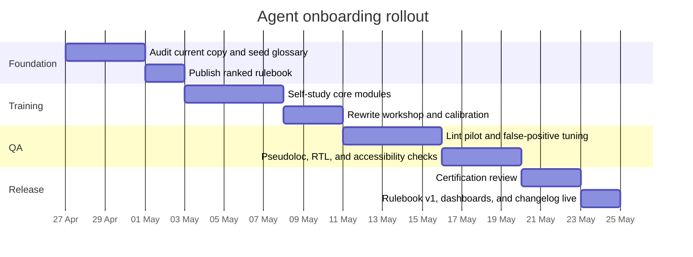
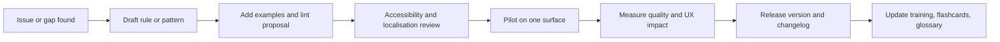

# Concise Copywriting System for Workspace Design-System Agents

## Executive summary

A good copy system for agents should behave more like a protocol than a style essay: small, ranked, testable, and paired with reusable patterns. Across official guidance from Google Material, Microsoft, Apple, Atlassian, Shopify, Google Search Central, Google Technical Writing, and accessibility/localisation standards from the entity["organization","World Wide Web Consortium","web standards body"], the strongest consensus is not “be more brand-like”; it is “reduce ambiguity at the point of action.” The recurring defaults are plain language, specific actions, strong labels, concise structure, context-aware tone, recovery-oriented errors, and strings that remain accessible and localisable. citeturn7view1turn7view10turn7view11turn19search11turn7view0turn5view8turn17view1turn18view2

The main cross-system divergence is casing and a few platform conventions. Material and Atlassian broadly standardise sentence case for titles, headings, labels, and buttons, while Apple often specifies title-style capitalisation for some action controls. A generalised rulebook therefore should not hard-code one platform’s casing everywhere; it should default to sentence case and then allow host-surface exceptions. citeturn8search0turn15search3turn19search1

For agent learning, the evidence points toward short modules, discrete rewrite drills, pattern cards, and peer calibration rather than long prose guidelines. Google’s own technical-writing curriculum is modular, beginner-friendly, and intentionally split between foundational pre-class skills and integrated in-class practice. For enforcement, WCAG guidance explicitly assumes a combination of automated testing and human evaluation, and official platform guidance points to ongoing accessibility testing rather than one-off review. For measurement, Google’s HEART framework remains a useful anchor because it ties writing quality back to user-centred product outcomes instead of vanity metrics. citeturn20view0turn20view1turn20view3turn5view7turn13view8turn19search10turn16search1

The recommended operating model is therefore:

| Artifact | Purpose for agents | Recommended format |
|---|---|---|
| Ranked rulebook | Memory layer | 1 page, ordered rules |
| Pattern cards | Application layer | per surface/pattern |
| Before/after bank | Calibration layer | short rewrite sets |
| Lint spec | Enforcement layer | machine-readable checks |
| Human review checklist | Exception layer | 1 page yes/no questions |
| Flashcards | Retention layer | spaced-repetition deck |
| Glossary and termbase | Consistency layer | canonical terms with owners |
| Change log and examples | Governance layer | versioned release notes |

## Research foundation

This report draws primarily from official guidance for Material content design, Microsoft writing and globalisation guidance, Apple HIG writing and accessibility materials, Atlassian content guidance, Shopify/Polaris design and accessibility guidance, Google Search Central, Google Technical Writing, and the W3C accessibility and internationalisation documents. The evidence base is strongest for UI copy, forms, procedural docs, messages, and discovery surfaces such as titles and snippets. Landing-page rules below are therefore a synthesis of UI writing, technical writing, and search guidance rather than a single-vendor marketing playbook. citeturn0search0turn7view0turn19search11turn15search2turn14view1turn18view0turn18view2turn20view0

### Purpose and scope

The scope map below translates the source material into a design-system view of “what copy is for” on each surface.

| Surface | Primary job of copy | Typical failure mode | Dominant rule emphasis |
|---|---|---|---|
| UI and microcopy | Help the user act correctly | Hesitation, wrong action, abandonment | labels, CTAs, clarity, consistency |
| Landing pages | Explain value and invite a next step | Puffery, mismatch, weak trust | headlines, proof, CTA clarity |
| Docs and help | Enable self-serve completion | Support dependence, misconfiguration | scope, headings, steps, examples |
| Error states | Enable recovery | User blames self or gives up | cause, fix, placement, tone |
| Notifications | Confirm or alert without overload | Alert fatigue, ignored updates | priority, brevity, dismissibility |
| SEO surfaces | Match search intent and set expectation | Keyword dumping, misleading snippets | H1/title alignment, page-specific summaries |

This map is consistent with official guidance that emphasises scannable instructions and clear headings for procedures, concise and specific UI writing, user-recoverable errors, and descriptive titles and snippets for search. citeturn7view2turn20view3turn15search2turn14view3turn18view0turn5view12

### What the sources agree on

Across the sources, the stable centre of gravity is clarity. Google’s technical-writing guidance explicitly says clarity takes precedence, and it repeatedly pushes specific verbs, consistent terminology, one idea per sentence, and documents that begin with scope and audience. Microsoft likewise emphasises simple words, concise sentences, scannability, and imperative steps. Apple’s HIG writing guidance adds plain language, accessibility, localisation awareness, and avoidance of jargon and gendered terminology. citeturn7view11turn20view3turn20view0turn7view1turn7view2turn19search11

The other strong point of agreement is situational tone. Microsoft promotes friendly, helpful, concise, non-blaming content; Shopify explicitly separates voice from tone and says tone changes with context; Atlassian says tone should change depending on situations such as errors versus success; Apple frames interface writing as clear, conversational, and helpful; and Google’s error-writing guidance recommends a positive, instructive, neutral tone without unnecessary apologies or humour. A design system should therefore define a stable voice and a state-based tone model, rather than letting every writer improvise. citeturn7view0turn5view6turn6search1turn19search2turn21search10

Accessibility and localisation are not edge constraints. WCAG requires errors to be indicated in text and labels or instructions to be provided where user input is required. Microsoft says a form element’s accessible name should be the same as its displayed label; WCAG’s “label in name” guidance reinforces that visible text and programmatic name should align. Material frames global writing as inclusive writing optimised for localisation. Microsoft and W3C go further: avoid concatenation, externalise strings, support per-string language and direction metadata, plan for expansion and mirroring, and test with pseudolocalisation and localisation QA. Shopify also warns not to hide essential information in tooltips because they are desktop-only and non-interactive. citeturn5view8turn5view9turn5view13turn7view13turn8search1turn17view0turn17view1turn13view4turn13view3turn13view10

For search and landing pages, Google Search Central is unusually consistent: create helpful, people-first content; use words people actually search for; make titles and page headings align; write page-specific meta descriptions; and avoid keyword stuffing or a mythical “preferred word count.” It also makes clear that titles and snippets are generated from page content and may vary by query, so design-system guidance should optimise for accurate expectation-setting, not literal control of SERP text. citeturn18view2turn18view1turn5view12turn18view0

### Tone and voice model

The table below is the recommended “stable voice, variable tone” model derived from the sources above.

| Situation | Tone | Must include | Avoid |
|---|---|---|---|
| Default workflow | Calm, direct, helpful | task language | hype, jokes |
| Onboarding | Encouraging, brief | why this matters, next step | long philosophy |
| Success | Brief, confident | confirmed outcome | repeated celebration |
| Warning | Serious, concrete | risk, consequence, choice | vagueness |
| Error | Neutral, instructive | problem, fix | blame, humour, unnecessary apology |
| Landing page | Benefit-led, specific | value, proof, action | empty claims |

This model fits Microsoft’s non-blaming warmth, Shopify’s voice-versus-tone distinction, Atlassian’s state-based tone, Apple’s clear/helpful language, and Google’s instructive error tone. citeturn7view0turn5view6turn6search1turn19search2turn21search10turn15search2

### Trade-offs

The hardest design-system failures usually come from optimising the wrong side of a trade-off.

| Trade-off | Choose the first side when | Choose the second side when | Safe default |
|---|---|---|---|
| Clarity vs persuasion | user is acting, deciding, recovering, or granting access | user already understands the task and needs motivation | clarity first, then add light persuasion |
| Brevity vs completeness | copy is frequent, low-risk, and routine | state is destructive, unfamiliar, billing-related, or recovery-critical | be as short as possible, but never so short that the next action is unclear |

This matches the source pattern: routine UI writing should scan fast, but error states, warnings, and instructions need enough information to avoid confusion; likewise, search and landing pages should stay people-first and accurate rather than click-maximised. citeturn7view10turn7view2turn5view9turn5view8turn14view3turn18view2

A direct implication is that word count is a poor primary quality metric. Google explicitly says it has no preferred word count for content, and both accessibility and error-handling guidance show that some states require more explanation, not less. citeturn18view2turn5view9turn21search8

## Compact rulebook

The most efficient training structure is three mastery bands: memorise a small core, drill the surface patterns, and enforce the technical constraints with tooling and review. That mirrors Google’s split between discrete foundational lessons and later integration exercises. citeturn20view0turn20view1

Surface codes below: **UI** interface and microcopy, **LP** landing pages, **D** docs/help, **E** error states, **N** notifications, **SEO** search/discovery surfaces, **G** accessibility/localisation constraints.

### Memorise

| Rank | Rule | Quick pass test | Surfaces | Lint |
|---|---|---|---|---|
| 1 | Put the user’s task or outcome first. | Can the first line tell me what this is for? | All | Partial |
| 2 | Use plain everyday English. | Would a first-time user know these words? | All | Partial |
| 3 | Keep one idea per sentence. | Can I split this sentence cleanly in two? | All | Partial |
| 4 | Prefer specific nouns and strong verbs. | Did I name the object and the action? | All | Partial |
| 5 | Remove filler and throat-clearing. | Does every word earn its place? | All | Partial |
| 6 | Use active voice by default. | Can I see who does what? | All | Partial |
| 7 | Keep terminology consistent. | Am I using one term for one concept? | All | Yes |
| 8 | Fit copy to audience skill. | Is this written for the actual user, not the team? | All | No |
| 9 | Follow host-surface conventions before brand flair. | Does this sound native to the surface? | All | No |
| 10 | Default to sentence case unless the surface says otherwise. | Am I using the platform default correctly? | UI, LP, D, SEO | Yes |
| 11 | Make labels specific enough to stand alone. | Would the label still make sense out of context? | UI, E, G | Partial |
| 12 | Make CTAs name the action. | Is the first word a useful verb? | UI, LP, N | Yes |
| 13 | Make headings scannable and distinctive. | Can someone navigate by headings alone? | LP, D, SEO | Partial |
| 14 | Make body copy add value, not repeat the heading. | Does the line after the heading say something new? | LP, D, N | No |

### Apply by pattern

| Rank | Rule | Quick pass test | Surfaces | Lint |
|---|---|---|---|---|
| 15 | Labels identify; help text explains. | Did I separate naming from instruction? | UI, E | Partial |
| 16 | Placeholders never replace labels. | Would the field still be clear after typing begins? | UI, G | Yes |
| 17 | Give instructions only where needed. | Is there a real ambiguity to resolve? | UI, D, E | No |
| 18 | Include format or constraint only when it changes success. | Does this rule help completion? | UI, D, E | No |
| 19 | Errors must appear in text and state the problem. | Would the user know what failed without colour alone? | E, G | Partial |
| 20 | Errors must explain how to fix the problem. | Can the user recover without support? | E | Partial |
| 21 | Name the invalid value or violated rule when helpful. | Did I tell them what exactly is wrong? | E | Partial |
| 22 | Use neutral, non-blaming tone in errors. | Does the copy blame the system/problem, not the person? | E | Partial |
| 23 | Success messages should confirm the result, then get out of the way. | Can I shorten this after the confirmation? | N | Partial |
| 24 | Warning and destructive copy should state consequence, condition, and safest next step. | Does the user know the risk before acting? | N, E, UI | No |
| 25 | Keep optional notification CTAs short and specific. | Is the CTA one concrete action? | N | Partial |
| 26 | Ask only for necessary input. | Do we truly need this field now? | UI, LP | No |
| 27 | If asking for non-obvious input, explain why. | Would a user see the benefit of answering? | UI, LP, N | No |
| 28 | For procedures, use numbered, imperative steps. | Can each step start with a clear verb? | D | Partial |

### Protect quality

| Rank | Rule | Quick pass test | Surfaces | Lint |
|---|---|---|---|---|
| 29 | Start docs with scope, audience, and key points. | Can a reader tell whether this doc is for them? | D | Partial |
| 30 | Structure landing pages as promise, proof, then action. | Does the page explain value before asking for conversion? | LP | No |
| 31 | Write SEO copy for people first, not keyword first. | Would this still be useful without search traffic? | LP, SEO | Partial |
| 32 | Make page titles unique and aligned with the H1 and page intent. | Would search and page title tell the same story? | SEO | Yes |
| 33 | Make meta descriptions page-specific summaries, not keyword dumps. | Does this describe this exact page? | SEO | Yes |
| 34 | Use the words real users search for. | Would a novice search this phrasing? | LP, SEO, D | Partial |
| 35 | Avoid jargon, idioms, metaphors, unexplained acronyms, and gendered-generic language. | Could this confuse, exclude, or fail in translation? | All | Partial |
| 36 | Do not concatenate or ambiguously reuse strings. | Would this still translate cleanly if reordered? | G | Yes |
| 37 | Externalise strings and add translator context, especially for placeholders. | Could a translator understand the sentence without code? | G | Yes |
| 38 | Support expansion, locale formatting, language/direction metadata, and RTL. | Would this still work in a longer or mirrored locale? | G | Partial |
| 39 | Keep visible labels aligned with accessible names. | Would Voice Control or speech input work with the visible text? | G, UI | Partial |
| 40 | Keep critical information out of tooltips and text out of images where possible. | Is the essential instruction visible and screen-readable? | UI, LP, G | Partial |

These rules compress the strongest recurring guidance from the source set into defaults that are simple enough for agents to recall and specific enough for tooling to check. The casing exception in rank 10 exists because official systems do differ there. citeturn8search0turn15search3turn19search1

## Patterns and examples

The examples below are original examples built from the official guidance. They are intended as training material, not quotations. Their purpose is to give agents short, repeatable transformations they can learn quickly. citeturn20view1turn21search1

### Headlines

Headline guidance across the sources consistently favours scannable, descriptive titles over generic mood-setting. Microsoft says headings in procedures should concisely describe what instructions help users do; Google emphasises clear structure and key points; Google Search wants a distinctive main title aligned with the page; and Material says a dialog’s purpose should be communicated by its headline and actions. citeturn7view2turn20view3turn5view12turn8search8

| Template | Use when |
|---|---|
| **[Outcome] for [audience]** | landing-page hero |
| **[Action] [object]** | page title or empty state |
| **[Topic or result]** | doc section or dashboard section |

| Before | After | Why it improves |
|---|---|---|
| A better way to work | Plan team work in one workspace | names the task |
| Powerful collaboration for modern teams | Collaborate on files without version mix-ups | adds outcome |
| Streamline operations effortlessly | Automate approval workflows | replaces puffery with action |
| Get clarity across every initiative | See task status across projects | makes the benefit concrete |
| Advanced enterprise control centre | Manage permissions and security settings | explains what the page does |

### CTAs

Atlassian recommends imperative verbs and says success-message CTAs should usually be one or two words. Material’s extended FAB guidance also says to use one to two words at most, partly because localisation expands strings. Apple’s control guidance favours verb-led labels, and Shopify’s app guidance repeatedly rejects vague headings and CTAs that lack context. citeturn7view9turn8search12turn19search1turn14view3

| Template | Use when |
|---|---|
| **[Verb] [object]** | primary CTA |
| **[Verb] [alternative]** | secondary CTA |
| **[Verb] [object]** with concrete risk | destructive CTA |

| Before | After | Why it improves |
|---|---|---|
| Get started | Create workspace | names the first action |
| Learn more | See pricing | sets expectation |
| Continue | Invite teammates | removes ambiguity |
| Submit | Save changes | tells user what will happen |
| Confirm | Delete project | makes destructive action explicit |

### Labels

WCAG requires labels or instructions for user input, Microsoft says a form element’s accessible name should match the displayed label, and Apple says labels should be concise for fast navigation. Shopify also requires labels on form elements. The result is a strong general rule: labels should name the field clearly enough to stand alone and remain aligned with the accessible name. citeturn5view9turn5view13turn19search3turn14view1

| Template | Use when |
|---|---|
| **[Object or data type]** | basic text field |
| **[Object] [qualifier]** | when “Name”, “Type”, “Time” would be ambiguous |
| **[Choice to make]** | pickers and selectors |

| Before | After | Why it improves |
|---|---|---|
| Name | Workspace name | removes context dependence |
| Time | Meeting duration | says what “time” means |
| Type | Export file type | narrows the choice |
| Owner | Project owner | distinguishes from creator or approver |
| Email | Billing email address | tells user where it is used |

### Help text

WCAG allows instructions where needed but explicitly warns against clutter; Microsoft and Shopify treat helper text as the place for formats, constraints, and extra context; and Shopify notes that helper and error text are announced to screen readers. Tooltips are not a safe replacement because Shopify says they are non-essential, desktop-only, and unsuitable for critical information. citeturn5view9turn12search11turn13view10

| Template | Use when |
|---|---|
| **Use [format].** | input format matters |
| **This [affects/result].** | consequence matters |
| **Optional. [Value or reason].** | input is optional but useful |

| Before | After | Why it improves |
|---|---|---|
| Enter details here. | Use the name shown on customer invoices. | gives a real instruction |
| Optional. | Optional. Add a note your team can see. | explains the value |
| Add URL. | Paste the full link, including https://. | provides the required format |
| Provide valid input. | Use 8–20 characters, with at least 1 number. | replaces vagueness with rule |
| Tell us more. | This description appears in the workspace directory. | explains consequence |

### Error states

WCAG requires text-based error identification, Shopify requires clear corrective errors next to relevant fields where possible, and Google’s error-writing guidance says good errors identify the cause, state constraints, and explain how to fix the problem. Google also recommends a positive, instructive tone rather than blame or unnecessary humour. citeturn5view8turn14view3turn13view9turn21search0turn21search3turn21search10

| Template | Use when |
|---|---|
| **[Problem]. [Fix].** | most field-level errors |
| **You need [role] to [action].** | permission error |
| **Use [allowed format/limit].** | format, type, or size error |

| Before | After | Why it improves |
|---|---|---|
| Invalid value. | Enter a date after 25 Apr 2026. | gives rule and recovery |
| Something went wrong. | We couldn’t upload the file. Try a file under 100 MB. | names failure and fix |
| Email error. | Enter a work email address, for example name@company.com. | shows expected format |
| Permission denied. | You need Admin access to change billing settings. | says who can fix it |
| Unsupported format. | Use CSV or XLSX for imports. | removes guesswork |

### Notifications

Atlassian’s message guidance says success messages should confirm the outcome and get out of the way, avoid over-celebration, and use short concrete CTAs. Warning copy should use imperative action labels, and Shopify’s quality rules require onboarding and error guidance to remain concise, obvious, and easy to follow. citeturn7view9turn15search0turn14view3

| Template | Use when |
|---|---|
| **[Outcome].** | routine success |
| **[Outcome]. [Optional next step].** | success with a logical follow-up |
| **[Risk]. [Action].** | warning |
| **[Update]. [Why it matters].** | information banner |

| Before | After | Why it improves |
|---|---|---|
| Success! | Project created. | confirms result fast |
| Great news! You’re all set. | SSO is on. Test sign-in before logging everyone out. | replaces cheer with useful next step |
| Heads up! | Storage is almost full. Remove unused files or upgrade storage. | states risk and action |
| Reminder | Invoice due tomorrow. | makes the content specific |
| Done! | Five reports are ready to export. | says what completed |

### Docs task content

Microsoft’s procedure guidance calls for concise headings, numbered steps, imperative verbs, one instruction per step, and headings that tell users what they can do. Google’s documentation guidance adds scope, audience, key points, and paragraph/topic discipline. The best design-system pattern for docs is therefore “task first, then ordered action.” citeturn7view2turn20view3turn20view0

| Template | Use when |
|---|---|
| **This guide shows [audience] how to [task].** | intro paragraph |
| **[Action] [object]** | section heading |
| **[Imperative verb] [object].** | individual step |

| Before | After | Why it improves |
|---|---|---|
| Configuration | Set up single sign-on | names the task |
| In this article, we will cover a number of things related to SSO. | This guide shows admins how to set up single sign-on. | states scope and audience |
| The user should then click Save after entering the values. | Enter the values, then click Save. | uses imperative structure |
| Advanced options | Choose default permission levels | tells reader what choice they are making |
| It is possible to invite a teammate by selecting Invite. | Select **Invite people**. | shortens and clarifies |

### SEO titles and meta descriptions

Google Search Central says titles are critical because they help users decide whether to click, and it advises unique titles, strong alignment with the main page title, and page-specific meta descriptions. It also says meta descriptions should be short, relevant summaries rather than keyword dumps, and that there is no universal fixed length because snippets are truncated to device width. Titles and snippets are generated from page content and can vary by query, so the design-system goal is accurate expectation-setting, not literal control. citeturn5view12turn18view0turn18view1turn18view2

| Before | After | Why it improves |
|---|---|---|
| **Title:** Project Management Software, Team Tasks, Workspace, Collaboration  **Meta:** Best project tool for teams. | **Title:** Project management software for product teams — Acme  **Meta:** Plan tasks, track milestones, and share updates in one workspace. | unique, specific, people-first |
| **Title:** Internal Wiki Docs Knowledge Base  **Meta:** Learn more about our docs. | **Title:** Team wiki and internal docs — Acme  **Meta:** Create internal docs, policies, and project notes your team can search fast. | aligns with page intent |
| **Title:** Pricing Affordable Plans  **Meta:** Pricing page. | **Title:** Workspace pricing for teams of any size — Acme  **Meta:** Compare Free, Pro, and Enterprise plans, including seats, storage, and admin controls. | summarises the exact page |
| **Title:** Calendar Sync  **Meta:** Sync your calendar today. | **Title:** Calendar sync for Google and Outlook — Acme  **Meta:** Connect Google Calendar or Outlook so deadlines and meetings stay in sync. | includes meaningful detail |
| **Title:** AI Notes Feature  **Meta:** AI notes, notes AI, note summary AI. | **Title:** AI meeting notes and summaries — Acme  **Meta:** Turn recorded meetings into action items, summaries, and follow-up drafts. | avoids keyword stuffing |

## Training and rollout

Google’s writing curriculum is useful here for two reasons: it is designed for learners who are not already strong writers, and it breaks instruction into short units that teach one skill at a time before asking learners to integrate them. That pattern translates well to agent enablement. citeturn20view0turn20view1

### Proficiency lanes

| Lane | Must master | Allowed autonomy | Escalate when |
|---|---|---|---|
| Novice agent | ranks 1–14, glossary, templates | routine UI copy and simple CTAs | destructive copy, SEO, localisation edge cases |
| Intermediate agent | ranks 1–28, pattern cards, review checklist | UI, onboarding, notifications, procedural docs | new patterns, policy copy, high-risk warnings |
| Advanced agent | all 40 rules, lint triage, exception handling | all surfaces | rule changes, terminology changes, governance decisions |

### Training modules

The curriculum below is intentionally short. It borrows the modular pacing of Google’s lessons and adds rewrite drills, because that is where agents learn fastest. citeturn20view0turn20view1

| Module | Time | Learning objectives | Quick exercises |
|---|---:|---|---|
| Core rules and glossary | 35 min | plain language, strong verbs, consistent terms, sentence case default | rewrite 10 vague strings; choose the canonical term from a glossary set |
| Headlines and CTAs | 30 min | task-first titles, specific CTAs, promise-proof-action | rewrite a hero section; replace 5 vague CTAs with verb-object CTAs |
| Labels and help text | 30 min | label specificity, helper-text boundaries, placeholder misuse | repair a broken form; turn 5 placeholders into labels plus helper text |
| Error states and warnings | 40 min | cause, fix, tone, field proximity, consequence language | rewrite 5 generic errors; draft a destructive confirmation message |
| Notifications and onboarding | 30 min | concise confirmations, meaningful next steps, justified questions | reduce a verbose toast; explain why 3 onboarding questions are needed |
| Docs and procedures | 35 min | scope line, headings, numbered steps, parallel structure | rewrite a setup guide intro; split a paragraph into ordered steps |
| Landing pages and SEO | 35 min | people-first copy, H1/title alignment, page-specific descriptions | write 3 title/meta pairs; remove keyword stuffing from a section |
| Accessibility and localisation QA | 45 min | label-in-name alignment, no tooltip-only essentials, no concatenation, pseudoloc/RTL checks | identify 8 localisation risks; fix 5 accessible-name mismatches |
| Calibration review | 30 min | apply lint results, score against checklist, handle exceptions | blind-review two variants; decide approve, revise, or escalate |

A compact programme can therefore be delivered in about **5 hours** of guided training, then reinforced through review. That is close to the structure Google uses for pre-class and in-class technical-writing instruction. citeturn20view1

### Flashcards

| Front | Back |
|---|---|
| What wins by default? | Clarity over persuasion; task success over brand flourish. |
| What is the job of a label? | Identify the field or control. |
| What is the job of help text? | Explain format, consequence, or edge case. |
| What makes a CTA good? | Imperative verb plus clear object. |
| What must every error include? | Problem plus fix. |
| When should completeness beat brevity? | Warnings, destructive actions, billing, security, unfamiliar settings. |
| What should never carry critical information alone? | Placeholder text or tooltip text. |
| What breaks localisation most often? | Concatenation, ambiguous reuse, text in images, missing placeholder notes. |
| What must match for speech and screen-reader reliability? | Visible label and accessible name. |
| What should SEO copy optimise for? | People-first intent, not keyword stuffing. |

### Onboarding rollout

The rollout below sequences foundations before linting, and linting before certification, because the sources consistently separate foundational learning from integrated review and testing. citeturn20view1turn5view7turn13view8

## Enforcement and governance

WCAG is explicit that accessibility conformance is supported by both automated testing and human evaluation. Apple recommends automated accessibility audits as part of regular build workflows, and Shopify recommends ongoing accessibility testing with tools such as Accessibility Insights, Lighthouse, and WAVE. The right operating model is therefore **lint first, human review second, audit continuously**. citeturn5view7turn19search10turn13view8

### Automated lint checklist

The table below is a generic, stack-agnostic lint starter set. It is intentionally biased toward rules that are cheap to detect and expensive to miss.

| Check | Failure example | Detection idea | Severity |
|---|---|---|---|
| Sentence case mismatch | `Create Workspace` in a sentence-case surface | regex plus casing allowlist | Warn |
| Vague CTA | `Continue`, `Submit`, `Confirm` | denylist with exception allowlist | Warn |
| Placeholder used as label | field has placeholder but no visible label | form schema or UI inspection | Error |
| Generic error | `Invalid value` | denylist in error strings | Error |
| Error lacks fix | `We couldn’t save.` | require second clause or fix pattern | Warn |
| Label too generic | `Time`, `Type`, `Name` | generic-label denylist | Warn |
| Tooltip contains critical instruction | tooltip includes `required`, `must`, `error`, `warning` | keyword scan on tooltip text | Error |
| Duplicate page titles | same title across distinct URLs | page inventory check | Error |
| Title and H1 mismatch | title and H1 have low lexical overlap | similarity threshold | Warn |
| Keyword-stuffed meta description | repeated keywords, list-like description | repetition threshold | Warn |
| Unexplained acronym | uncommon acronym appears without expansion | glossary cross-check | Warn |
| Glossary mismatch | both `workspace` and `space` used for the same concept | termbase validator | Warn |
| Gendered generic pronoun | `he/she`, generic `his` | pattern match | Error |
| String concatenation risk | split sentence fragments in resources | resource pattern scan | Error |
| Missing translator note for placeholder | string contains `{planName}` with no comment | resource metadata check | Error |
| Visible label and accessible name mismatch | label says `Password`, accessible name says `Enter password here` | accessibility tree diff | Error |
| Image-only control missing text equivalent | icon button has no accessible label | accessibility audit | Error |
| Exclamation overuse | routine UI string ends with `!` | punctuation rule | Warn |

### Human review checklist

Automated checks catch repetition and structural defects. Human review catches meaning, risk, and context.

| Review question | Pass condition |
|---|---|
| Can a first-time user tell what this page, field, or button is for? | first line or label answers that clearly |
| Is the next action explicit? | CTA or step names the action |
| Is any sentence trying to do too much? | each sentence has one main job |
| Is the tone right for the state? | calm for routine, instructive for errors, serious for warnings |
| Does the label stand alone? | still clear without nearby body copy |
| Is essential information visible on touch and mobile? | no critical meaning depends on hover/tooltip |
| Could the user recover from an error without contacting support? | fix is stated or implied clearly |
| Would this still make sense if translated and reordered? | no concatenation assumptions, enough context |
| Does speech or screen-reader use still work? | visible label matches accessible name; structure is navigable |
| Are any claims misleading, inflated, or unprovable? | copy matches the actual product and page |
| Does the page title, H1, and description tell the same story? | search and page experience align |
| If we ask for data, is the value to the user explained? | reason is clear when not obvious |

### Versioning

Governance should use simple semantic versioning so agents know what changed and whether retraining is needed.

| Release type | Use when | Example change | Retraining impact |
|---|---|---|---|
| Major | default rules or terminology change | sentence-case default changed; glossary concept renamed | high |
| Minor | new rule, pattern, or lint | new notification pattern; new SEO lint rule | medium |
| Patch | example, wording, or clarification update | better example bank; typo fixes | low |
| Exception record | temporary product-specific override | Apple-only title-style surface; legal wording requirement | local only |

Microsoft’s localisation guidance also argues for target-language style guides and translation memories. In practice, that means governance should version the rulebook **together with** the glossary, translator notes, and pattern library, not as separate afterthoughts. citeturn13view2turn14view4

### Contribution workflow

This workflow keeps the examples, lint specification, and localisation metadata attached to every rule change, which is the safest way to preserve consistency across releases and languages. citeturn13view2turn17view1

## Measurement and dashboards

For measurement, use a two-layer model: **user-centred outcome metrics** plus **copy-quality QA metrics**. Google’s HEART framework is still a strong organising frame because it links product goals to user-centred metrics at scale; used here, it prevents the system from over-optimising for clicks, word count, or cosmetic brevity alone. Google Search guidance reinforces the same point: optimise for people-first usefulness, not search-engine-first volume or arbitrary lengths. citeturn16search1turn18view2turn18view0

### Suggested KPIs

The targets below are suggested starting benchmarks, not universal standards.

| KPI | Dimension | Definition | Suggested starting target |
|---|---|---|---:|
| Lint pass rate | QA | passing strings ÷ checked strings | ≥ 95% |
| First-pass review approval | QA | approved without rewrite ÷ reviewed items | ≥ 85% |
| Median review turnaround | Ops | median time from draft to decision | ≤ 2 working days |
| Terminology inconsistency rate | QA | glossary violations ÷ checked items | ≤ 2% |
| Task completion rate | HEART Task Success | successful completions ÷ starts | trend up |
| Error recovery rate | HEART Task Success | recoveries after recoverable error ÷ recoverable errors shown | ≥ 70% |
| Onboarding completion rate | HEART Adoption | users completing core onboarding flow ÷ starters | trend up |
| Copy-related support ticket rate | HEART Happiness / QA | tickets tagged copy confusion per 1,000 active users | trend down |
| Label-accessible-name mismatch rate | Accessibility QA | mismatches ÷ audited controls | 0 critical |
| Pseudoloc overflow rate | Localisation QA | overflow defects ÷ audited screens | ≤ 1% |
| Missing translator-note rate | Localisation QA | placeholder strings without notes ÷ placeholder strings | 0 |
| Unique title coverage | SEO QA | unique page titles ÷ indexable pages | ≥ 98% |
| Page-specific meta coverage | SEO QA | pages with distinct descriptions ÷ indexable pages | ≥ 95% |
| Organic CTR on high-impression pages | HEART Engagement / SEO | clicks ÷ impressions on tracked pages | trend up |

### Sample dashboards

| Dashboard | Audience | Core widgets | Why it matters |
|---|---|---|---|
| Copy quality and release | content ops, design systems | lint pass rate, first-pass approval, median turnaround, top failing rules | catches process and consistency defects early |
| User success and recovery | product, UX, support | task funnel, error recovery rate, onboarding completion, support tickets per 1,000 users | shows whether copy improves user outcomes |
| Accessibility and localisation | accessibility, content ops, localisation | label-name mismatches, pseudoloc overflow, missing translator notes, RTL regressions | keeps international quality visible |
| Search and acquisition | content, growth | unique title coverage, page-specific meta coverage, high-impression low-CTR pages, title/H1 mismatch alerts | connects page copy to discoverability |

### Dashboard interpretation rules

Treat QA metrics as guardrails and outcome metrics as the real score. A page with shorter copy is not automatically better; a CTA with higher clicks is not automatically more helpful; and a search snippet that drives clicks but misstates the page promise is a quality failure, not a win. Google’s people-first guidance, Google’s lack of a preferred word count, and WCAG’s requirement for enough information to identify errors and complete input all point in the same direction: optimise for successful, trustworthy completion. citeturn18view2turn18view0turn5view8turn5view9