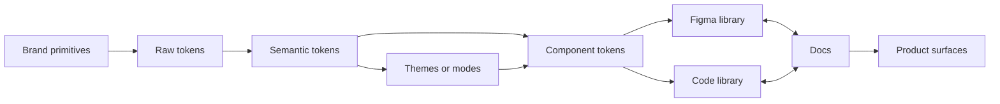
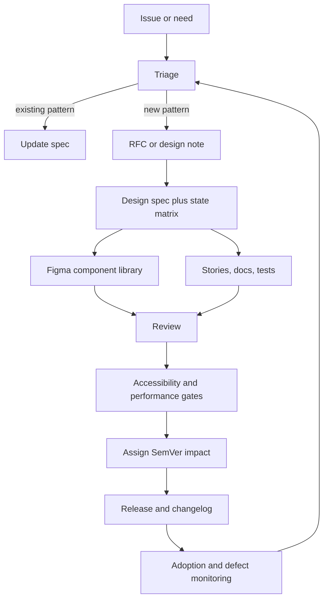

# Generalised UI/UX Design Rules for Workspace Design Systems

## Executive summary

A workspace design system should optimize **predictability, scanability, keyboard efficiency, state clarity, and controlled extensibility** over novelty. Across official guidance from WCAG/WAI, Carbon, USWDS, Apple, Material, Figma, Storybook, ICU, and SemVer, the same operating pattern emerges: encode design decisions as tokens, expose them through documented components, ship every important state intentionally, measure quality in production, and govern change like an API. citeturn22view0turn23view0turn24view2turn24view3turn26view4turn28view0turn35search4turn32view1turn31view0

For agents implementing and maintaining such a system, the most reliable default posture is:

- **Use layered, role-based tokens**: raw values → semantic roles → component tokens → themes/modes. This is the most scalable structure for theming, consistency, and tool interoperability. citeturn24view2turn24view3turn26view1turn26view2turn26view3
- **Use tokenized spacing and layout**: prefer an 8px-derived rhythm, allow 4px and 2px only where density requires it, and anchor page layout to a tokenized grid rather than ad hoc columns. citeturn24view0turn24view1turn26view7turn38view0
- **Treat accessibility as a system constraint, not a QA phase**: text contrast at least 4.5:1, large text at least 3:1, interactive/non-text boundaries at least 3:1, visible keyboard focus, predictable focus order, and minimum pointer targets of 24×24 CSS px, with 44–48 px/pt as the ergonomic touch default. citeturn22view1turn23view0turn23view3turn24view5turn28view0turn40view1turn40view3
- **Ship full state models**: default, hover, focus, active, selected, disabled, loading, empty, success, warning, error, overflow, RTL, and reduced-motion states should exist in both design and code examples. citeturn24view6turn25view0turn25view2turn32view1turn36view0
- **Use Storybook and Figma as linked learning surfaces**: Storybook provides isolated stories, tests, and living documentation; Figma component properties, descriptions, and documentation links reduce misuse and handoff drift. citeturn25view0turn25view3turn25view4turn25view5turn32view0turn32view1
- **Version the system like software**: declare the public contract, use SemVer, deprecate before removal, and publish migration guidance for breaking changes. citeturn31view0turn36view0
- **Measure actual usage and quality in the field**: use task success, error rates, satisfaction, accessibility evaluation, and p75 Core Web Vitals from real-user data. citeturn12search0turn22view7turn39view0turn39view1turn39view2

## Evidence base and design assumptions

Primary references for this report were guidance from the entity["organization","World Wide Web Consortium","web standards body"], entity["company","Google","technology company"]’s Material Design, entity["company","Apple","technology company"] design guidance, entity["company","IBM","technology company"] Carbon, the entity["organization","U.S. General Services Administration","us federal agency"]’s USWDS, entity["company","Figma","design software company"], entity["organization","Storybook","ui documentation project"], ICU/Unicode documentation, and the SemVer specification. WCAG 2.2 is normative; WAI “Understanding” documents and APG are informative implementation guidance. The DTCG format is useful for planning token interoperability, but its current draft is explicitly a preview rather than a W3C standard. citeturn22view0turn27view4turn28view0turn17search3turn26view4turn25view0turn32view1turn34view0turn31view0turn26view1

The recommendations below are generalized for **workspace-style surfaces**: dense forms, tables, lists, sidebars, multi-pane layouts, repeated task flows, and components with many interaction states. That bias favors clarity and reuse over visual novelty, and favors systems that remain predictable under responsive layout, keyboard navigation, localization, and theming. citeturn23view0turn24view0turn24view6turn32view1

## Core operating model

The most robust workspace design systems reduce variability at the **value layer** and preserve flexibility at the **composition layer**. In practice: tokens carry design decisions, components expose safe variation, documentation explains intended use, and measurement closes the loop. Carbon and USWDS both anchor visual decisions in tokens; Carbon and Storybook both treat reusable, documented components as the operative unit of scale; Figma supports constrained variation through properties and variants; DTCG explicitly frames tokens as a tool-to-tool exchange format. citeturn24view2turn24view3turn26view4turn26view5turn25view0turn25view1turn25view2turn25view5turn26view1turn26view2

| Principle | What it protects | System expression |
|---|---|---|
| Consistency | Reduced cognitive load | Tokenized spacing, color, type, and naming |
| Hierarchy | Scanning and task priority | Semantic type scale, layout grouping, restrained accent color |
| Affordance | Discoverability | Visible controls, sufficient targets, stable icon vocabulary |
| Feedback | Trust and recoverability | Explicit states, status messages, progress, inline validation |
| Accessibility | Operability for more users | Keyboard support, contrast, language metadata, predictable focus |
| Performance | Perceived speed and stability | Field-measured LCP/INP/CLS, low layout shift, modular loading |
| Scalability | Lower maintenance cost | Component APIs, SemVer, review gates, migration paths |
| Theming | Brand and mode adaptation | Role-based tokens and theme contexts |
| Tokens | Reliable reuse | Raw → semantic → component layering |
| Componentization | Fast implementation | Small composable parts with documented constraints |

The table above is a synthesis of the official source set, not a direct quotation. It reflects Carbon’s role-based tokens and definition-of-done model, USWDS’s tokenized foundations, WAI/APG accessibility behaviors, Storybook’s component-first workflow, and SemVer’s API discipline. citeturn24view2turn24view3turn26view4turn23view0turn32view1turn36view0turn31view0



This token flow is the recommended default for workspace systems because Carbon, USWDS, and DTCG all emphasize tokenized, role-based values, while Figma and Storybook provide the right control surfaces for constrained variation and living documentation. citeturn24view2turn24view3turn26view1turn26view2turn26view5turn26view6turn25view0turn25view5

### Comparing spacing systems

The practical choice is not “4pt or 8pt” in the abstract; it is which scale minimizes inconsistency while still handling dense UI. Carbon already uses 2, 4, and 8 increments; USWDS uses 8px multiples with extra small values. For workspace systems, the strongest default is **8px-derived spacing plus constrained 4px/2px micro-adjustments inside dense components only**. citeturn24view1turn26view7

| Option | Strengths | Risks | Best use |
|---|---|---|---|
| 4pt-only | Fine control | Easy to overfit; more one-off spacing | Very compact controls if governance is strong |
| 8pt-only | Strong rhythm; easy to teach | Too coarse for tight data UIs | General page layout and coarse spacing |
| 8pt + limited 4pt/2pt | Best balance of rhythm and density | Needs guardrails to avoid drift | **Recommended default** for workspace systems |

### Comparing grid options

USWDS provides a clear 12-column responsive grid with tokenized gutters and breakpoint utilities; Carbon’s 2x grid and CSS Grid guidance are stronger for dense, nested product layouts; Material’s adaptive layout guidance supports split-pane patterns where task context needs to persist. The correct policy is therefore: **12-column responsive page grid by default, with CSS Grid and split-pane patterns for dense product surfaces**. citeturn38view0turn24view0turn37view0turn5search7

| Option | Strengths | Risks | Best use |
|---|---|---|---|
| 12-column responsive grid | Familiar, teachable, scalable | Can feel rigid for component internals | Forms, dashboards, settings, content pages |
| CSS Grid / intrinsic layout | Strong for nested panes and dense enterprise UI | Harder to govern without templates | Data-heavy workspace shells and composite layouts |
| Split-pane adaptive layout | Preserves context in productivity flows | Not ideal as a universal base grid | Master-detail, navigation + content, inspector panes |

### Comparing token structures

Carbon and USWDS both favor **role-based** tokens; DTCG explicitly supports multi-context token resolution such as light and dark modes. Flat value tokens are workable for tiny libraries, but layered tokens are materially better for scale, theming, and migration. citeturn24view2turn24view3turn26view2turn26view5turn26view6

| Structure | Strengths | Risks | Recommended use |
|---|---|---|---|
| Flat value tokens | Simple to start | Weak semantics; poor theming | Very small libraries only |
| Semantic tokens | Better intent and themeability | Can become vague if naming is loose | Good baseline |
| Raw → semantic → component | Strongest scaling and migration model | Requires discipline and ownership | **Recommended default** |

## Rule library

The rule cards below are generalized for agent ingestion. They synthesize official guidance on naming, layout, typography, accessibility, states, internationalization, tokens, and documentation from Apple, WAI/APG, WCAG, Carbon, USWDS, Material, Figma, Storybook, ICU, and DTCG. citeturn37view1turn24view0turn24view1turn22view1turn23view0turn24view6turn28view0turn35search8turn34view0turn25view0turn25view5

### Layout and visual language rules

| Rule | Agent card |
|---|---|
| Naming | **Phrase:** Name by intent, not implementation. **Why:** Clear, consistent names improve searchability, reuse, and handoff quality. **Good:** `Button/Primary`, `color.text.default`. **Bad:** `Btn1`, `blue500`, `cmp-new`. **Implementation:** Keep the same root names in code, Figma, and docs; avoid abbreviations; add descriptions and linked docs in Figma. **Accessibility:** Terms should stay predictable between labels, docs, and test cases. **Checklist:** clear, unambiguous, searchable, stable. citeturn37view1turn25view3turn37view0 |
| Spacing | **Phrase:** Use spacing tokens only. **Why:** Tokenized spacing preserves rhythm and density control. **Good:** `8, 16, 24`; `space-2`, `space-3`. **Bad:** `13, 22, 37`; arbitrary per-screen padding. **Implementation:** Use an 8px-derived base; allow 4px/2px only inside dense components; never encode raw spacing in components. **Accessibility:** Preserve room for focus indicators and readable grouping. **Checklist:** tokenized, rhythmic, no magic numbers, dense-only micro-steps. citeturn24view1turn26view7turn36view0 |
| Grid | **Phrase:** Use a responsive tokenized grid; never freehand columns. **Why:** Predictable layout improves scanability and reflow. **Good:** 12-column page grid with tokenized gutters. **Bad:** per-page custom fractions and visual-only reordering. **Implementation:** Use a 12-column page grid by default; use CSS Grid for nested product shells; keep DOM order aligned with reading order; tokenize gutters and container widths. **Accessibility:** Visual order and keyboard/screen reader order must stay logical. **Checklist:** page grid defined, gutters tokenized, DOM order logical, breakpoints explicit. citeturn38view0turn24view0turn23view3 |
| Typography | **Phrase:** Use semantic type roles, not ad hoc sizes. **Why:** Hierarchy is easier to learn and harder to break when type is role-based. **Good:** `body-sm`, `body-md`, `heading-02`, `label-sm`. **Bad:** screen-specific `15px semi-bold`. **Implementation:** Define a small role-based scale, line-height tokens, weight tokens, and usage rules tied to layout hierarchy. **Accessibility:** Preserve zoom/reflow; keep primary text comfortably legible; Apple advises text of at least 11pt and generally higher for key reading contexts. **Checklist:** semantic roles, limited scale, line-height tokens, role-to-template mapping. citeturn24view4turn15search8turn15search15turn28view0 |
| Color and hierarchy | **Phrase:** Use color to express role, not raw brand paint. **Why:** Role-based color makes hierarchy, state, and theming durable. **Good:** `text-primary`, `surface-error`, `border-subtle`. **Bad:** direct hex in component code or a single “brand blue” doing every job. **Implementation:** Use semantic color roles; keep neutrals doing most of the work; use accent colors sparingly for action and status. **Accessibility:** Text needs at least 4.5:1 contrast, large text at least 3:1, and interactive/non-text boundaries at least 3:1. **Checklist:** semantic roles, contrast checked, no color-only meaning, theme-safe. citeturn24view2turn26view5turn26view6turn22view1turn36view0 |

### Interaction and resilience rules

| Rule | Agent card |
|---|---|
| Affordance and targets | **Phrase:** Interactive things must look interactive and be easy to hit. **Why:** Discoverability and accuracy both drop when controls are too subtle or too small. **Good:** visible button or clickable boundary plus adequate padding. **Bad:** plain text behaving like a button or a tiny icon with no target padding. **Implementation:** WCAG 2.2 AA sets a 24×24 CSS px floor; touch-first ergonomics are better around 44–48 px/pt, matching Apple, Carbon, and Material guidance. Increase target area with padding, not oversized icon glyphs. **Accessibility:** Do not rely on color alone to signal interactivity; keyboard operation must match pointer operation. **Checklist:** visible affordance, 24×24 AA minimum, 44–48 touch default, padded hit area. citeturn40view1turn28view0turn24view5turn16search0 |
| Focus and keyboard | **Phrase:** Every interactive flow works by keyboard with visible, predictable focus. **Why:** WAI APG identifies visible focus, persistence of focus, and predictable focus movement as core keyboard design requirements. **Good:** tab order follows reading order; focus returns sensibly after dialogs close. **Bad:** focus disappears to `body`, jumps unpredictably, or gets trapped. **Implementation:** Prefer native controls first; manage focus on DOM changes; document shortcuts; test keyboard paths in Storybook. **Accessibility:** Keep focus visible, logical, and persistent. **Checklist:** native first, visible focus, logical order, no traps, focus restored. citeturn23view0turn23view2turn23view3turn32view1 |
| States and feedback | **Phrase:** Every component ships with a complete state model. **Why:** Workspace UIs fail most often in non-default states, not in the happy path. **Good:** default, hover, focus, active, selected, disabled, loading, empty, success, warning, error, overflow. **Bad:** only a default mock and ad hoc state handling later. **Implementation:** Use variants for structural differences and component properties for content-level changes; require Storybook stories for default, playground, and edge states. **Accessibility:** State changes must be perceivable without color alone; status messages must be exposed without forcing a context change. **Checklist:** full state matrix, Figma variant/property mapping, stories for edge cases, docs for when to use each state. citeturn25view0turn25view2turn24view6turn22view2turn32view1 |
| Error handling | **Phrase:** Prevent errors first; when errors happen, show cause, fix, and recovery. **Why:** WCAG requires labels/instructions and text error identification; disappearing or vague errors slow users down. **Good:** inline field error, text explanation, preserved input, optional form summary. **Bad:** toast-only failure, red border with no text, cleared form values. **Implementation:** Validate close to the field; distinguish warnings from errors; keep required status in the label; for form-wide failures, add a stable summary above the form. **Accessibility:** Errors must be described in text, not color alone; meaningful status messages should be announced. **Checklist:** labels present, text errors present, recovery path clear, input preserved. citeturn22view3turn21search19turn22view2 |
| Iconography | **Phrase:** Icons assist text; they rarely replace meaning. **Why:** Carbon and USWDS both stress consistency and clarity for icon use. **Good:** icon + label, or icon-only for a universally understood action with an accessible name. **Bad:** ambiguous unlabeled icons or the same icon meaning different things in different places. **Implementation:** Keep a small approved icon vocabulary; use solid monochrome icons; size the touch target, not just the glyph. **Accessibility:** Decorative icons should be hidden from assistive tech; meaningful icons need names; interactive icons should meet text-like contrast in Carbon guidance. **Checklist:** meaning stable, label available, touch target padded, decorative vs meaningful explicit. citeturn24view5turn15search20turn35search7 |
| Motion | **Phrase:** Use motion to explain change, not decorate. **Why:** Material explicitly emphasizes consistent transitions, and W3C requires support for reduced-motion preferences. **Good:** brief motion that clarifies origin, destination, or progress. **Bad:** parallax, ornamental bounce, or large movement that adds no meaning. **Implementation:** Tokenize motion; keep durations short; support `prefers-reduced-motion`; replace non-essential movement with fades or no motion. **Accessibility:** Reduced motion support should remove or simplify non-essential motion, especially interaction-triggered motion. **Checklist:** meaningful, consistent, optional, reduced-motion safe. citeturn35search8turn22view5turn18search3 |
| Localization | **Phrase:** Design for locale change from day one. **Why:** ICU, W3C i18n, and Apple all make clear that locale-specific data, directionality, and text expansion are first-class design concerns. **Good:** externalized strings, locale-aware numbers/dates, language and direction metadata, room for expansion, RTL-safe icon choices. **Bad:** concatenated strings, hard-coded `MM/DD/YYYY`, ZIP-only forms, icons flipped when meaning should stay fixed. **Implementation:** Separate code from strings, format data in a locale-sensitive manner, keep code locale-independent, externalize resources as key-value data, and attach language/direction metadata where strings move between systems. **Accessibility:** Declare page language; support bidirectional text correctly; ensure translated instructions remain understandable. **Checklist:** strings externalized, locale formatting used, expansion tolerated, bidi metadata present, form fields not culturally narrow. citeturn34view0turn34view1turn34view2turn34view4turn34view5turn19search6turn29search1turn29search9 |

### System architecture rules

| Rule | Agent card |
|---|---|
| Tokens and theming | **Phrase:** All visual decisions flow through tokens. **Why:** Carbon and USWDS both use role-based tokens so themes can change values without rewriting components. **Good:** raw → semantic → component tokens with light/dark/high-contrast modes. **Bad:** direct hex, px, or one-off shadows inside components. **Implementation:** Keep token names role-based; add themes/modes as contexts; verify contrast per theme; do not let components own raw values. **Accessibility:** Every theme must pass contrast and focus checks. **Checklist:** layered tokens, role-based names, theme contexts, no direct values in components. citeturn24view2turn24view3turn26view2turn26view5turn26view6turn35search4 |
| Componentization | **Phrase:** Build small composable components, but constrain variation. **Why:** Storybook and Figma work best when components are isolated, documented, and expose only the right controls. **Good:** structural differences as variants; text/icon swaps as properties; default and playground stories. **Bad:** a single “mega component” with dozens of booleans and hidden state logic. **Implementation:** Use Figma variants for visibly different states and sizes; use properties for content-level changes; link Storybook back into Figma. **Accessibility:** Native semantics should survive composition; state and accessible name should remain explicit. **Checklist:** small API, constrained variation, design-doc links, story coverage. citeturn25view0turn25view2turn25view4turn25view5turn32view1 |
| Performance and scalability | **Phrase:** Performance budgets are part of API quality. **Why:** web.dev defines Core Web Vitals as user-centric metrics for load speed, responsiveness, and layout stability; Carbon also treats modular packaging and compile-time efficiency as system-level quality work. **Good:** modular packages, lazy heavy states, stable skeletons, low layout shift. **Bad:** monolithic bundles, blocking synchronous work, or dynamic layout jumps when data arrives. **Implementation:** Track p75 LCP, INP, and CLS in the field; enforce per-component weight budgets; test loading and error states; prefer isolated stories for hard-to-reach slow cases. **Accessibility:** Slow UI is an accessibility issue when it delays feedback, traps focus, or shifts content unexpectedly. **Checklist:** field metrics tracked, budgets defined, loading tested, no avoidable CLS. citeturn39view0turn39view1turn39view2turn37view0 |

## Learning formats and onboarding

Figma component properties, descriptions, and linked docs are effective because they reduce misuse at the source. Storybook complements this by rendering components in isolation, preserving hard-to-reach states as stories, generating living docs, and exposing history/versioning in the review loop. For agents, the training surface should therefore be **short lesson + explicit rule + concrete example + runnable artifact + assessment**. citeturn25view0turn25view3turn25view4turn25view5turn32view0turn32view1

| Format | Best use | Recommended shape | Pass condition |
|---|---|---|---|
| Micro-lessons | Initial learning | 10–15 minutes; one principle, one failure mode, one artifact | Agent can restate the rule and apply it once |
| Checklists | Pre-merge quality control | 1 screen, yes/no gates | No ambiguous checks |
| Flashcards | Retention | Q/A; one card per rule threshold or distinction | 90% recall on weekly review |
| Good/bad examples | Pattern recognition | Paired screenshots or component states | Agent can explain why bad is bad |
| Code snippets | Implementation memory | Tiny, copyable, stack-light examples | Runs or translates with minimal edits |
| Figma patterns | Design authoring | one canonical component set + descriptions + docs link | No unexplained variants |
| Storybook patterns | Engineering authoring | Default, playground, all-states, RTL, reduced-motion, overflow, loading, error stories | Stories cover contract and edge cases |

### Sample flashcards

| Prompt | Expected answer |
|---|---|
| Why use semantic tokens instead of raw hex values? | Because semantic roles survive theming and reuse better than literal values. |
| What is the WCAG 2.2 AA minimum target size? | 24×24 CSS px, with exceptions; touch ergonomics are usually better at 44–48. |
| When should a variant be a Figma property instead? | When the change is content-level, not a structural/state difference. |
| What is the minimum text contrast ratio for normal text? | 4.5:1. |
| What must happen after closing a dialog? | Focus should return logically and remain visible. |
| What is the first question for an icon-only action? | “Will meaning still be obvious without nearby text?” |

### Reference snippets

A token file should encode role first and value second; component code should consume semantic or component tokens, not primitives. This aligns with Carbon and DTCG-style token thinking. citeturn24view2turn24view3turn26view1turn26view2

```json
{
  "color": {
    "raw": {
      "blue": { "$value": "#0050d8" }
    },
    "semantic": {
      "text-primary": { "$value": "{color.raw.blue}" },
      "surface-error": { "$value": "#fff1f1" }
    },
    "component": {
      "button-primary-bg": { "$value": "{color.semantic.text-primary}" }
    }
  },
  "space": {
    "1": { "$value": "4px" },
    "2": { "$value": "8px" },
    "3": { "$value": "16px" }
  }
}
```

A Storybook contract should make edge cases first-class, not optional. Storybook explicitly recommends isolated stories for tricky states and Autodocs for living documentation. citeturn32view1turn25view5

```ts
export const Default = {};
export const Playground = { args: { label: "Save", icon: true } };
export const AllStates = {};
export const Loading = {};
export const Error = {};
export const Overflow = {};
export const RTL = {};
export const ReducedMotion = {};
```

Locale-sensitive formatting must be handled by locale APIs or ICU-style formatting classes, not string concatenation or manual punctuation rules. citeturn34view0turn34view2

```js
const price = new Intl.NumberFormat(locale, {
  style: "currency",
  currency
}).format(value);

const date = new Intl.DateTimeFormat(locale, {
  dateStyle: "medium"
}).format(new Date());
```

### Sample 4-week training syllabus

The sequence below is designed for agents who will both implement and maintain the system. It front-loads tokens and accessibility, then moves into componentization, governance, and field measurement because those are the highest-leverage failure points in real systems. citeturn36view0turn23view0turn39view2

| Week | Modules | Estimated time | Assessment | Practical exercise |
|---|---|---:|---|---|
| Week one | Foundations; hierarchy; naming; spacing; grid; typography; color; token layers | 8–10 hours | 20-question rule quiz + critique of one existing screen | Refactor one dense workspace page into tokenized layout + semantic type |
| Week two | Components; variants vs properties; states; affordance; focus; iconography; motion | 8–10 hours | Build review against checklist | Create Button, TextField, Tabs, EmptyState in Figma and Storybook |
| Week three | Errors; forms; localization; RTL; accessibility testing; responsiveness; performance basics | 8–10 hours | Accessibility and localization test pass | Add loading/error/overflow/RTL/reduced-motion stories to 3 components |
| Week four | Governance; SemVer; contribution flow; tokens management; metrics; regression testing | 8–10 hours | Release simulation + migration note | Submit a mock component proposal, version it, review it, and publish docs |

## Governance and contribution model

The most stable governance model treats the design system as both a **product** and a **public API**. SemVer requires a declared public API and explicit major/minor/patch semantics. Carbon’s component checklist extends that logic into design systems by requiring tokenized specs, defined states, responsiveness, globalization, Storybook coverage, documentation, accessibility verification, manual screen reader testing, and a design-kit/library path before stable release. citeturn31view0turn36view0



That loop is the recommended governance default because it preserves traceability from request through release and back into operational evidence. Storybook’s publishing/history model and Carbon’s definition-of-done make the review surface concrete rather than ceremonial. citeturn32view0turn36view0

### Governance policy table

| Area | Default policy |
|---|---|
| Versioning | **MAJOR** for breaking public contract changes, such as removed props, renamed tokens, changed semantics, or materially incompatible visual/behavioral contracts; **MINOR** for backward-compatible additions; **PATCH** for backward-compatible fixes. Always publish migration notes for MAJOR changes. citeturn31view0 |
| Contribution entry | Every change starts as an issue with one of: bug, gap, accessibility defect, performance defect, new pattern, or token request. |
| Definition of done | No component is “stable” until design, code, docs, kit, accessibility, and tests all pass. Carbon provides a strong model here. citeturn36view0 |
| Review checklist | Tokens only; all states specified; responsive behavior specified; focus order documented; labels/instructions present; error and status behavior defined; localization-safe strings; Storybook default and playground stories exist; docs linked in Figma; SemVer impact labeled. citeturn36view0turn25view3turn32view0 |
| Token management | New raw tokens are rare; prefer new semantic/component tokens first. Deprecate before removal. Test theme contrast before approving token changes. Track owners and changelog entries. citeturn24view3turn26view2turn26view5turn26view6 |
| Documentation flow | Figma description + external doc link, Storybook stories + Autodocs, and release notes/changelog for changes. citeturn25view3turn25view5turn32view0 |

## Measurement and anti-patterns

Official guidance is clear on two points: performance is a user-experience metric and should be measured in the field, while accessibility evaluation needs both quick checks and more robust assessment. Official usability guidance also points to success rates and customer satisfaction as core outcome measures. For a workspace design system, the useful measurement model is therefore a compact stack of **adoption, usability, accessibility, performance, quality, and governance** metrics. citeturn39view0turn39view2turn22view6turn22view7turn12search0

### Recommended KPI set

The KPI set below is a synthesis, not a direct standard. It is designed to operationalize official guidance in a maintainable way. citeturn39view0turn39view2turn12search0turn22view7

| KPI family | What to measure | Recommended cadence | Why it matters |
|---|---|---|---|
| Adoption | % of shipped surfaces using system components; % using tokens only | Monthly | Shows whether the system is becoming the default path |
| Consistency debt | Count of raw values, local overrides, and duplicate custom components | Weekly | Detects drift before it becomes architectural debt |
| Usability | Task success rate, critical error rate, time on task, post-task satisfaction | Per major workflow test | Digital.gov identifies success rates and satisfaction as core usability measures |
| Accessibility | Automated pass rate, manual keyboard pass rate, screen-reader checks, Easy Checks/WCAG-EM coverage | Per release | Quick checks are useful but not exhaustive; robust evaluation is still required |
| Performance | p75 LCP, INP, CLS on key workflows, measured in field data | Continuous | Core Web Vitals are explicitly user-centric and field-first |
| Quality | Visual regression failures, bug escape rate, stale-doc count, docs/story drift | Per release | Captures system reliability and documentation health |
| Governance | PR cycle time, migration completion rate, deprecated API burn-down | Monthly | Shows whether the system can evolve without chaos |

### Lightweight usability test template

| Field | What to capture |
|---|---|
| Objective | What design-system rule or component behavior is being tested |
| User profile | Role, experience level, accessibility needs, locale |
| Scenario | Real task, not abstract clicking |
| Success criteria | Completion, accuracy, confidence, time |
| Focus metrics | Success rate, critical errors, time on task, satisfaction |
| Variants | Default, loading, error, empty, overflow, small viewport, keyboard-only, RTL |
| Evidence | Notes, quotes, screen recordings, defect list, severity |
| Result | Keep as-is, revise guidance, revise component API, add story/test |

### Common anti-patterns

| Anti-pattern | Why it fails | Better replacement |
|---|---|---|
| Raw hex, px, shadow, or radius values inside components | Breaks theming and consistency | Consume semantic/component tokens only |
| Freehand spacing per screen | Creates visual drift and review noise | Use tokenized spacing and layout constraints |
| One “mega component” for every case | Unstable API, weak reuse, hard docs | Smaller composable parts with constrained variants |
| Designing only the default state | Most production bugs appear in edge states | Ship a full state matrix in Figma and Storybook |
| Color-only status cues | Fails accessibility and clarity | Add text, icon, and structural cues |
| Toast-only errors that disappear | Users lose the cause and fix | Inline error + stable summary/status where needed |
| Focus ring removed or visually subtle | Keyboard users lose their place | Preserve strong visible focus and logical focus return |
| Concatenated strings and hard-coded formats | Breaks localization and grammar | Externalize strings and use locale-aware formatting |
| Ambiguous icon-only actions | Meaning varies by user/context | Use text labels unless the action is truly universal |
| Storybook or Figma not updated with code | Drift destroys trust | Treat docs and stories as release artifacts |
| Breaking changes shipped as “small fixes” | Consumers cannot migrate safely | Use SemVer and explicit migration notes |
| Measuring only library adoption | Hides UX failure | Pair adoption with usability, accessibility, and field performance |

## Open questions and limitations

This report is intentionally **stack-agnostic** and biased toward **web-first workspace systems**. If the target includes native iOS, Android, desktop, or highly regulated domains, you should tighten host-platform specifics for target size, navigation, system conventions, and testing requirements. Also, DTCG is valuable for planning token interoperability, but its format module is still a preview rather than a standards-track W3C recommendation. citeturn28view0turn16search0turn26view1