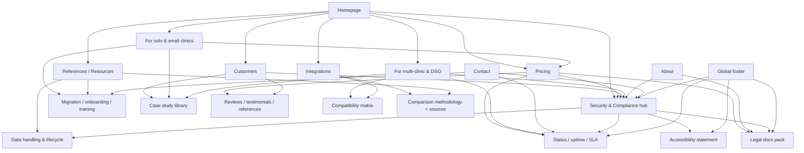

# Oralstack trustworthiness content report

**Source:** External deep-research report received 2026-04-28.
**Status:** Reference material — not a sprint plan. Recommendations are sequenced by horizon (short / mid / long term) below.
**Editorial note:** Inline citation tags (`citeturn…`) and entity-extraction wrappers (`entity[…]`) from the research tool have been stripped for readability; substantive claims, recommendations, and benchmark URLs are preserved verbatim. Two broken sandbox wireframe image links removed.

## Executive summary

Oralstack already does more than most early-stage healthcare SaaS sites to make its product concrete: the site has public pilot pricing, persona pages for solo and multi-clinic buyers, a public security page, a public changelog, interactive demo tools, a named pilot case study, and unusually strong operations references for front-desk, billing, and imaging workflows. Those are real trust assets, especially because they are specific and current rather than generic marketing copy.

The main trust gap is packaging, not intent. Today, the public site still asks evaluators to assemble trust from scattered pages: Security, FAQ, Pricing, About, Terms, Privacy, and one customer story. The site also states that founder bios are still being written; that public API docs are not yet available; that HIPAA is a design principle rather than a completed attestation; and that the public Terms cover the marketing site only, while product customers sign a separate MSA. For a dental-practice buyer, admin lead, or clinician, that creates avoidable diligence friction during evaluation and procurement.

The highest-impact additions are therefore durable trust pages that remain useful regardless of the final feature set: a single Security & Compliance hub; a public legal and data-handling pack; a status/reliability page with SLA language; a stronger case-study system with named operators and methodology; an integration compatibility matrix; and clearer company/team stewardship content. These additions align with what official regulators require buyers to think about for HIPAA, GDPR, PDPA, and accessibility, and they mirror how stronger dental and healthcare SaaS sites reduce risk perception before a demo.

## Current-state audit

### What already builds trust

Oralstack's best current trust signals are specificity and operational realism. The homepage is explicit about being built in Singapore for APAC, shows a named live-demo clinic, lists concrete workflows, links to a public changelog, and surfaces real operational references instead of abstract value claims. Pricing is public and unusually clear for an early-stage B2B SaaS product. The FAQ answers data export, migration, hosting, and controller/intermediary questions directly. The case study for DFI Synergy gives a credible implementation narrative rather than generic praise.

The site also already contains a good foundation for domain credibility. The references pages are practical, Singapore-specific, and PMS-agnostic in tone; they read like operator documentation rather than lead magnets. This is a valuable differentiator because it signals subject-matter depth to office managers and clinicians before any product comparison even begins.

### Where trust still leaks

The gaps are mostly in evaluation-grade proof. Oralstack has a security page, but not yet a central trust hub, public legal-document cluster, status page, uptime history, accessible procurement pack, compatibility matrix, or accessibility statement. The footer exposes About, Security, Contact, Privacy, and Terms, but not the fuller "trust stack" now common on stronger healthcare SaaS sites, such as a status destination, a BAA/DPA entry point, or an accessibility page. By contrast, SimplePractice exposes Privacy, Terms, BAA, and System status together in the footer; athenahealth publishes a dedicated accessibility statement; and DrChrono and Curve Dental publish public system-status pages.

There is also a company-trust gap. The About page says Oralstack is early, pre-revenue, and hands-on, which is honest and generally good, but it also says founder bios are still being written. In a healthcare workflow category, that leaves buyers without the basic "who is operating this system, what is their background, and who is accountable" reassurance they expect.

Finally, the regulatory posture is directionally sound but not yet presentation-ready for procurement. The site correctly avoids overclaiming: it says the data model is designed with PDPA and HIPAA requirements in mind, that it is not yet HIPAA-certified or SOC 2-attested, and that clinics remain the controller while Oralstack acts as data intermediary. That honesty should be preserved. The improvement is to package those statements into a clearer controller/processor or controller/intermediary narrative, with contracts, scopes, and limitations presented in one place. Official guidance from the US Department of Health and Human Services, Singapore's Personal Data Protection Commission, and the European Commission all point in that direction.

## Trust architecture by user journey

The trust model should match how different buyers actually evaluate dental SaaS.

| Journey | Primary readers | Main trust question | Content that should answer it |
|---|---|---|---|
| Discovery | Practice owners, office managers | "Is this real, credible, and relevant to my clinic?" | Homepage proof ribbon, pricing summary, customer logos/quotes, workflow references, role-based pages |
| Evaluation | Admin leads, clinicians, ops leaders, procurement | "Will this fit our risk, workflow, and integration reality?" | Security & Compliance hub, legal docs, compatibility matrix, named case studies, comparison methodology, ROI assumptions |
| Onboarding | Admins, front desk, clinicians | "Will go-live be safe and manageable?" | Migration guide, training center, implementation timeline, role-based checklists, support promises |
| Retention | Clinic leadership, superusers | "Can we rely on this vendor after purchase?" | Status page, uptime history, incident policy, changelog, support/SLA page, knowledge base, export/exit rights |

Oralstack already has strong discovery content and partial evaluation content; it is weakest in procurement-grade evaluation and post-sale trust reinforcement.

## Recommended content additions

Priority scale: **1 = highest priority**, **5 = lowest priority**.

| Content item | Purpose | Suggested copy outline / headlines | Ideal page(s) / placement | Format | Effort | Priority | Benchmarks / examples |
|---|---|---|---|---|---|---|---|
| Security & Compliance hub | Turn scattered risk signals into one evaluation-ready destination | "Security & compliance"; "Where data lives"; "How access is controlled"; "Backups, recovery, and incidents"; "Download legal docs"; "Ask a security question" | Add a persistent top-nav and footer item; link from Pricing, Customers, FAQ, Contact | Main page + downloadable PDF pack | Med | 1 | NexHealth Security Portal `https://security.nexhealth.com/`; CareStack Trust Center `https://trust.carestack.com/`; Curve Data Policy `https://www.curvedental.com/data-policy/` |
| Legal & procurement pack | Remove legal-review friction and make contracts legible before the demo | "Master Service Agreement overview"; "DPA / BAA availability"; "Product privacy notice"; "Subprocessors"; "Retention and deletion"; "Export on exit"; "Security questionnaire request" | Within Security hub and footer legal cluster; link from FAQ and pricing | Text pages + ungated PDFs + gated questionnaire pack if needed | Med | 1 | SimplePractice footer legal cluster + BAA link `https://www.simplepractice.com/privacy/`; NexHealth legal/security article `https://help.nexhealth.com/en/articles/12754290-what-is-nexhealth-s-legal-and-security-compliance-status`; HHS BAA requirements `https://www.hhs.gov/hipaa/for-professionals/covered-entities/sample-business-associate-agreement-provisions/index.html` |
| Data handling and lifecycle page | Clarify controller/intermediary or processor roles, retention, deletion, and cross-border handling | "What data we process"; "Clinic responsibilities vs Oralstack responsibilities"; "Residency and transfers"; "Retention"; "Deletion and backup restoration"; "What happens when you leave" | Security hub; FAQ; onboarding pack; linked from Terms/Privacy | Diagram + FAQ + summary page | Med | 1 | Curve Data Management `https://www.curvedental.com/data-management/`; European Commission controller/processor guidance `https://commission.europa.eu/law/law-topic/data-protection/rules-business-and-organisations/obligations/controllerprocessor/what-data-controller-or-data-processor_en`; existing Oralstack FAQ should be folded into this |
| Reliability, uptime, and SLA page | Make platform reliability visible to admins and DSOs | "System status"; "90-day uptime"; "Scheduled maintenance"; "Incident communication"; "Support response targets"; "RTO/RPO and backup summary" | Footer, login page, Security hub, support emails | Public status page + SLA summary page | Med | 1 | DrChrono Status `https://status.drchrono.com/`; Curve Status `https://www.curvedental.com/status`; SimplePractice System status link in footer `https://www.simplepractice.com/privacy/` |
| Integration compatibility matrix | Reduce post-sale surprise and make scope boundaries explicit | "Supported systems and vendors"; "Depth of integration"; "Deployment requirements"; "Known limitations"; "Export and migration notes"; "Last updated" | Integrations page; linked from persona pages, pricing, and case studies | Searchable table + PDF + short implementation notes | High | 2 | Curve imaging compatibility `https://www.curvedental.com/dental-image-software/`; NexHealth supported systems `https://docs.nexhealth.com/docs/supported-health-record-systems`; CareStack developer portal `https://developer.carestack.com/` |
| Migration, onboarding, and training center | Make change-management feel controlled, not risky | "What we migrate"; "Go-live phases"; "Role-based training"; "Read-only legacy access"; "First week support"; "Admin checklist"; "Clinician checklist" | New "Implementation" or "Onboarding" section; link from Pricing, FAQ, Customers | Text page + checklist + role-based videos + printable PDF | Med | 2 | Curve Training `https://www.curvedental.com/training`; Open Dental Training `https://www.opendental.com/site/training.html`; CareStack Academy `https://carestack.com/support/community/carestack-academy` |
| Case-study system with named proof and methodology | Replace "interesting story" with procurement-grade evidence | "Situation"; "Decision criteria"; "Implementation"; "Measured outcomes"; "Methodology"; "Quote from admin"; "Quote from clinician"; "Artifacts used" | Customers hub; homepage modules; persona pages; pricing sidebar | Longform page + 1-page PDF + 60-sec video | Med | 1 | NexHealth customer stories `https://www.nexhealth.com/resource/case-studies`; CareStack case studies `https://resources.carestack.com/case-study`; Curve testimonial format `https://www.curvedental.com/jesse-myers-testimonial` |
| Reviews, testimonials, and reference program | Provide broad social proof across roles and practice types | "What admins say"; "What clinicians say"; "What owners say"; "Verified reviews"; "Talk to a current customer" | Homepage, Customers, Pricing, footer, post-demo follow-up | Quote grid + video clips + review badges + reference-request form | Med | 2 | CareStack reviews `https://carestack.com/dental-software/reviews`; SimplePractice reviews `https://www.simplepractice.com/reviews/`; CareStack homepage logo wall and named operator quotes |
| Pricing transparency expansion | Keep the current pricing strength, but remove future uncertainty | "What's included today"; "What is out of scope"; "How post-pilot pricing changes"; "Group pricing principles"; "No export fees"; "What triggers custom quotes" | Pricing page + FAQ + sidebar on solution pages | Text + calculator + FAQ | Low | 2 | Oryx Dental Pricing `https://www.oryxdental.com/pricing/`; SimplePractice pricing `https://www.simplepractice.com/pricing/`; Curve pricing language `https://www.curvedental.com/pricing` |
| Team, company, and stewardship page | Answer "who is behind this and who is accountable?" | "Founders and backgrounds"; "Why this category"; "Company facts"; "Location and legal entity"; "Customer-access policy"; "Advisors / clinical reviewers" | About page, footer, legal pack, demo follow-up | Page with real bios, photos, company facts, and operating principles | Low | 2 | Curve Leadership `https://www.curvedental.com/leadership`; CareStack contact/locations `https://carestack.com/company/contact`; Oryx's "built by dentists" positioning on pricing/story pages `https://www.oryxdental.com/pricing/` |
| Clinical and operational credibility hub | Show domain depth without making unsafe clinical claims | "Reviewed by clinicians"; "Operational playbooks"; "Billing and records notes by market"; "What the software does not do"; "Clinical safety boundaries" | Expand current References section; link from product pages and Security hub | Articles + checklists + PDFs + short explainer videos | Med | 3 | CareStack Academy `https://carestack.com/support/community/carestack-academy`; Oryx "Built by Dentists for Dentists" `https://www.oryxdental.com/pricing/`; Curve imaging page with clinical workflow detail `https://www.curvedental.com/dental-image-software/` |
| Support and service commitments page | Improve both onboarding confidence and retention trust | "Support hours"; "Channels"; "Emergency escalation"; "Admin access logging"; "Quarterly review cadence"; "What support can and cannot access" | Contact, Pricing, Security hub, in-app help | Page + FAQ + printable SLA summary | Med | 2 | Curve Customer Service `https://www.curvedental.com/customer-service`; CareStack contact/support `https://carestack.com/company/contact`; Open Dental support `https://www.opendental.com/site/support.html` |
| Accessibility statement and tested environments | Signal inclusive design maturity and satisfy stricter procurement standards | "Accessibility statement"; "Conformance target"; "Browsers and assistive tech tested"; "How to report an issue"; "Review cadence" | Footer + Security hub + patient-facing pages | Statement page + feedback form | Low | 3 | athenahealth accessibility `https://www.athenahealth.com/resources/accessibility`; W3C accessibility guidance `https://www.w3.org/WAI/fundamentals/accessibility-intro/` |

### Notes on messaging discipline

Do **not** replace the site's current honesty with inflated compliance language. Keep the present nuance: Oralstack should say what it supports, what it is designed around, what it will contractually commit to, and what is still roadmap. That is more credible than broad language like "fully compliant" when formal attestations or certifications are not yet in place. Official HIPAA guidance is clear that contractual safeguards, business associate obligations, reporting duties, and security safeguards need to be concretely documented.

For local regulation, the durable pattern is not one giant "global compliance" claim. It is a **jurisdiction matrix** for each market actively sold into, with a date, role model, supported controls, contractual artifacts, and explicit out-of-scope notes. That approach better matches how PDPA accountability guidance and GDPR controller/processor obligations are framed.

## Placement architecture and visual aids

The site should treat trust content as permanent navigation, not buried support copy. The strongest pattern is: **Security / Trust** in the top nav, **Status** and **Accessibility** in the footer, and contextual links from Pricing, Customers, FAQ, persona pages, and Contact. SimplePractice's footer cluster and the public status pages from Curve and DrChrono show the right direction: trust pages should be one click away from any high-intent page.

## Content roadmap

Owners below are functional placeholders.

| Horizon | Deliverable | Owner | Why now |
|---|---|---|---|
| Short term | Launch Security & Compliance hub MVP by consolidating existing security, FAQ, data-hosting, and legal-language content into one page | Product marketing + founder + engineering | Fastest trust lift; mostly packaging existing material |
| Short term | Publish public legal cluster: product privacy notice, MSA summary, DPA/BAA availability, export/deletion summary, subprocessor placeholder | Founder + legal counsel | Current site-only Privacy/Terms language is too thin for evaluation |
| Short term | Expand pricing page with "included today / out of scope / post-pilot pricing policy / export rights / multi-clinic policy" | Product marketing + founder | Pricing is already a strength; this makes it safer to say yes earlier |
| Short term | Add named testimonial strip by role: owner, admin, clinician | Customer success + marketing | Homepage currently under-leverages social proof relative to competitors |
| Short term | Add sources and "last reviewed" notes to compare pages | Product marketing | Oralstack's brand promise is defensible claims; sourced comparisons reinforce that promise |
| Mid term | Launch public status page with uptime history, maintenance policy, and SLA summary | Engineering + support | Critical for admins, DSOs, and retention trust |
| Mid term | Build integration compatibility matrix with implementation notes and update dates | Product + engineering + solutions | High-value for dental buyers because imaging, messaging, billing, and migration failures are costly |
| Mid term | Release onboarding/training center with role-based checklists and short videos | Customer success + solutions | Converts migration anxiety into a managed process |
| Mid term | Standardize case study template with named customer, methodology, and downloadable PDF | Customer success + marketing | Oralstack already has one credible story; systematizing it multiplies trust |
| Mid term | Publish accessibility statement and feedback path | Design + frontend + QA | Low effort, increasingly expected in healthcare procurement |
| Long term | Evolve hub into trust center with downloadable security docs, questionnaire workflow, and periodic updates | Security/engineering + legal + marketing | Needed as deal size and diligence load grow |
| Long term | Create market-specific compliance annexes for each active geography | Legal + product marketing | Better than a vague global claim; aligns with how HIPAA, GDPR, and PDPA obligations differ |
| Long term | Publish quarterly transparency artifacts: uptime summary, major incidents, release highlights, roadmap changes, and customer evidence additions | Founder + engineering + customer success | Sustains trust after purchase, not just before it |

## Open questions and limitations

This assessment is based on public pages reviewed on April 28, 2026, not on unpublished contracts, a logged-in product experience, or private customer interviews.

Several items remain explicitly unspecified on the public site and should be treated as content gaps until published: founder bios, public API timing, final GA pricing, formal attestation timeline, and the long-term market plan outside APAC. Oralstack's own pages say founder bios are still being written, the public API is not yet available, pilot pricing is locked for 12 months with GA pricing later, SOC 2 and HIPAA attestation are roadmap items, and multi-region deployments outside APAC are out of scope today.

The core recommendation is therefore simple: **keep the current specificity, but reorganize it into a visible trust system.** Oralstack already has the raw material. What it needs next is easier proof, faster diligence, and clearer accountability.
